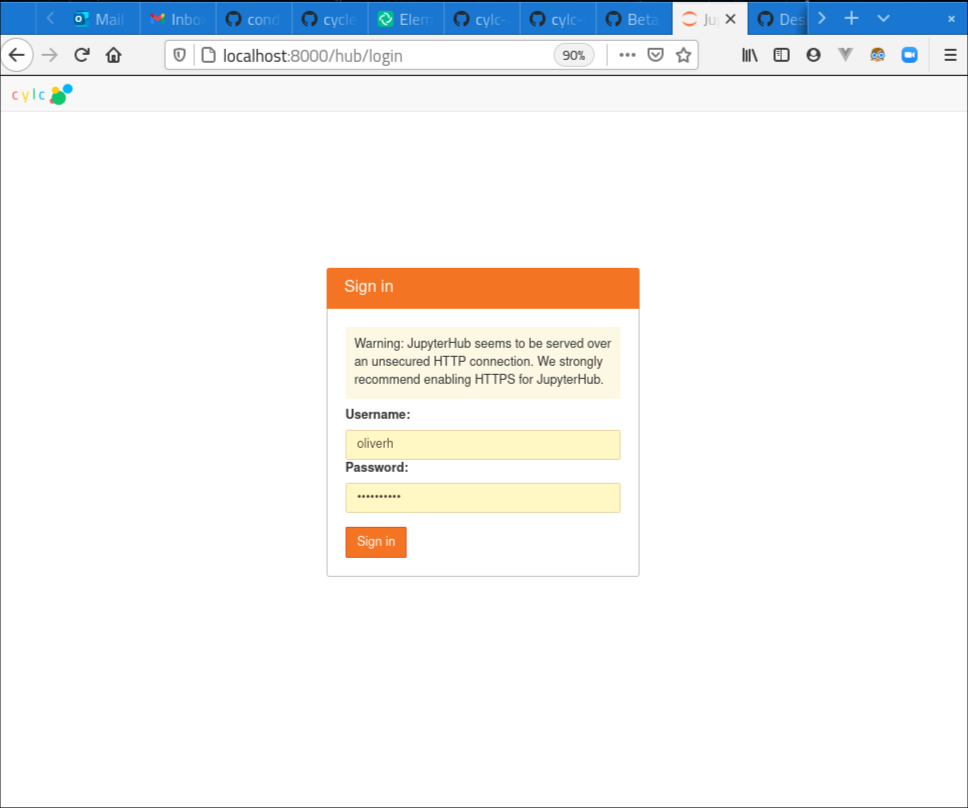

.. _728.ui:

Cylc 8 UIs
==========

There are two UI options available to monitor and control workflows at Cylc 8.

Cylc TUI
--------

Cylc TUI is a text based UI, available on the command line with
``cylc tui <workflow_id>``.

It remains in development, with smooth running with large workflows soon to be
resolved.

.. figure:: ../../img/cylc-tui.png
   :figwidth: 80%
   :align: center

   Cylc 8 TUI application

This replaces Cylc 7's ``cylc monitor``.

Cylc Web GUI
------------

Cylc 8 web GUI is available, both as a single user application, ``cylc gui``
and as a multi user hub, ``cylc hub``. Both are dependent on `Cylc UI Server`_ installation.

.. figure:: ../../img/cylc-ui-dash.png
   :figwidth: 80%
   :align: center

   Cylc 8 UI dashboard

.. figure:: ../../img/cylc-ui-tree.png
   :figwidth: 80%
   :align: center

   Cylc 8 UI workflow tree view

Launching the UI via the hub will require authentication.
The default Authenticator uses PAM to authenticate system users with their
username and password.

Going via the hub unlocks the ability to grant other users the permission
to view and interact with workflows running under your account.
Site administrators will need to configure this, for more information
see :ref:`cylc.uiserver.multi-user`.

   Cylc 8 Hub authentication page

See :ref:`UI_Server_config` for how to configure the GUI.

As some workflows can be very large, or even infinite, the UI uses a "window"
system to determine what to display. For more information, see :ref:`n-window`.

The UI continues to be developed.

.. TODO Possibly add more screen-grabs/information here.
