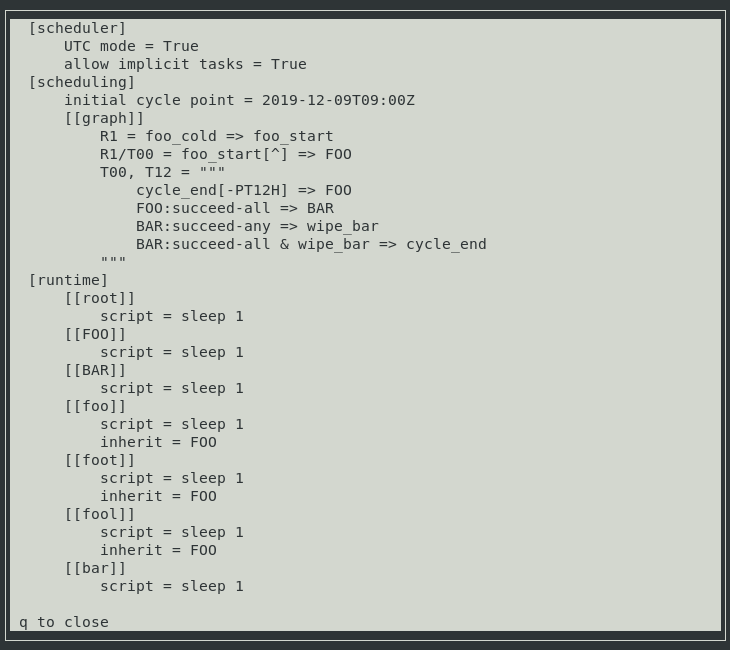

.. _728.ui:

Cylc 8 UIs
==========

There are two UI options available to monitor and control workflows at Cylc 8.

Cylc Tui
--------

Cylc Tui (TUI = Terminal User Interface) is a command line version of the GUI
which comes packaged with the Cylc scheduler.

It can by used to monitor and control any workflows running under your user
account, trigger tasks, access log files and perform other common activities.

Start Tui by running the ``cylc tui`` command.

   Tui showing the details of a failed job.

   A list of actions that can be performed on the selected task.

   Tui displaying the workflow configuration. It can also show scheduler and
   job log files.

Tui replaces the Cylc 7 ``cylc monitor`` command.

Cylc Web GUI
------------

The Cylc GUI application is a monitoring and control application which runs in
a web browser, it is distributed in the `Cylc UI Server`_ package which comes
separately from the core scheduler.

Start the GUI server and open the web app in your browser by running
``cylc gui``.

.. figure:: ../../img/cylc-ui-dash.png
   :figwidth: 80%
   :align: center

   The GUI homepage.

.. figure:: ../../img/cylc-ui-tree.png
   :figwidth: 80%
   :align: center

   The GUI displaying a workflow using the "tree" view.

See :ref:`UI_Server_config` for how to configure the GUI.

As some workflows can be very large, or even infinite, the GUI uses a "window"
system to determine what to display. For more information, see :ref:`n-window`.

Cylc Hub
--------

The Cylc 8 GUI can be deployed with Jupyter Hub to support multi-user access
where it is possible to grant users the permission to view and interact with
workflows running under other user accounts. In these deployments, users will
have to authenticate when they open the GUI in the browser.

The central server is started by the ``cylc hub`` command.

.. figure:: ../../img/hub.png
   :figwidth: 80%
   :align: center

   The Jupyter Hub authentication page in a multi-user setup.

Multi-user setups need to be configured by site administrators, for more
information see :ref:`cylc.uiserver.multi-user`.
