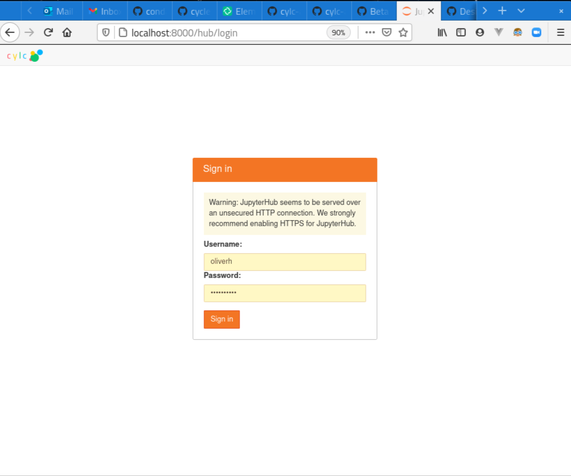
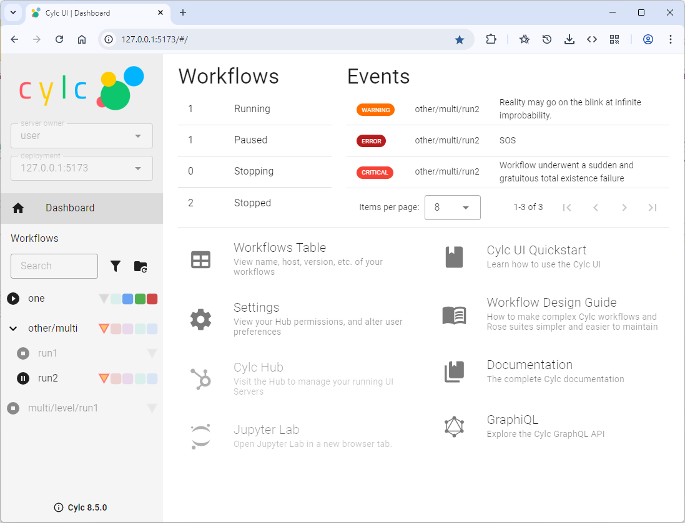
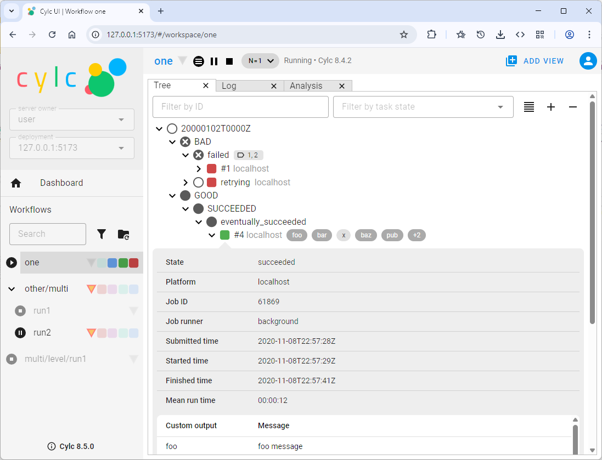
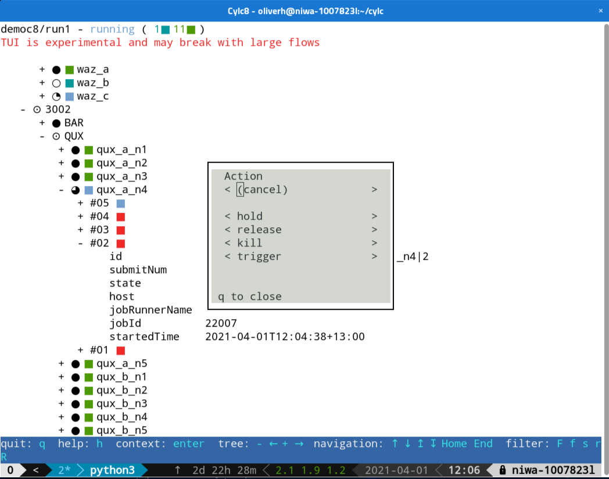
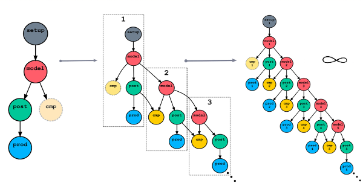
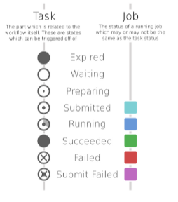

.. _overview:

Quick Summary Of Changes
========================

Terminology
-----------

- **Suite** is now **WORKFLOW** (a more widely understood term)
- **Suite daemon** (or **suite server program**) is now **SCHEDULER** (ditto)
- **Batch system** is now **JOB RUNNER** (not all of our job runners are "batch
  systems")

.. important::

   - And the Cylc config filename is now ``flow.cylc``, not ``suite.rc``

.. _Cylc_7_compat_mode:

Backward Compatibility
----------------------

To make the transition easier, Cylc 8 can run Cylc 7 workflows out of the box.
If Cylc detects that a workflow is using the deprecated ``suite.rc`` filename,
it will turn on a backwards compatibility mode, which:

- Allows :term:`implicit tasks <implicit task>` without having to set
  :cylc:conf:`flow.cylc[scheduler]allow implicit tasks` (unless a
  ``rose-suite.conf`` file is present in the :term:`run directory`, to maintain
  compatibility with Rose 2019).
- Sets the default :cylc:conf:`[scheduler]cycle point time zone` to local time
  of the workflow's initial start (including any daylight saving changes),
  rather than UTC.

.. TODO: mention optional outputs

.. warning::

   Please take action on any deprecation warnings emitted by ``cylc validate``.

   This must be done before renaming config files to ``flow.cylc``.

If your Cylc 7 workflow *fails* validation in Cylc 8, see
:ref:`AutoConfigUpgrades` to learn how to fix this.

Architecture
------------

Cylc has been re-architected to support a remote web UI. The main Cylc 8 system
components are:

- **Cylc Scheduler**
     - The workflow engine core, Python 3 based
     - Includes the **CLI** (Command Line Interface)
     - And **TUI**, a new Terminal UI application

- **Cylc Hub**
   - Authenticates users, spawns and proxies Cylc UI Servers
   - (A `Jupyterhub <https://jupyter.org/hub>`_ instance)
   - Can run as a regular or privileged user

- **Cylc UI Server**
   - Launched by the Hub
   - Interacts with Schedulers and the filesystem
   - Serves the UI to users

- **Cylc UI**
   - In-browser web UI, includes:
   - A dashboard with summary information and documentation links
   - Integrated gscan (multi-workflow) side-panel
   - Responsive web design (from desktop to table to mobile)
   - Tabbed interface to display multiple workflow views
   - Command integration for interacting with task, jobs, and schedulers

- **Network layers**
   - Incremental push updates (c.f. polled full-state updates in Cylc 7)

   Cylc 8 Hub authentication page

   Cylc 8 UI dashboard

   Cylc 8 UI workflow tree view

   Cylc 8 TUI application

Scheduling Algorithm
--------------------

Cylc has to be able to manage infinite workflows of repeating tasks:

See :ref:`Cylc 7 Scheduler Deficiencies Fixed by Cylc 8`

Cylc 8 has an efficient new **Spawn on Demand** scheduler that:
   - Only needs to be aware of current active tasks, and what comes next
   - Handles alternate path branching without suicide triggers
   - Can run tasks out of cycle point order
   - Enables a sensible active-task based window on the evolving workflow
   - Supports a powerful new capability called **reflow**: you can trigger
     multiple "wavefronts" of activity in the graph at once, in the same
     scheduler

Task/Job Separation and States
------------------------------

**Tasks** are nodes in the abstract workflow graph, representing processes
you want to run on computers, and **jobs are the real processes**. Tasks can
have multiple jobs, thanks to automatic retries and manual re-triggering.

Cylc 7 had 13 task/job states. The GUI only showed tasks, with job data
from the latest task job.

Cylc 8 has only 8 task/job states. The Cylc 8 UI shows both task and jobs.
Task icons are monochrome circles; job icons are coloured squares. The running
task icon incorporates a radial progress indicator.

The removed Cylc 7 task states have been absorbed into the *waiting* state, but
you can see or infer what is being waited on: e.g. a queue, xtrigger, or
retry timer. For instance, a waiting task that already has one or more
associated jobs must be about to retry.

Window on the Workflow
----------------------

.. image:: ../img/n-window.png
   :align: center

The Cylc UI can't show "all the tasks" at once because the graph may be huge,
or even infinite in extent in cycling systems. The Cylc 8 UI shows:

- current **active tasks** (submitted, running, unhandled-failed)
  - plus waiting tasks that are only waiting on non-task dependencies: queues,
  runahead limit, clock-triggers, or xtriggers

- tasks up to ``n`` graph edges away from active tasks (default ``1`` edge)

Platform Awareness
------------------

.. seealso::

   - :ref:`Platforms at Cylc 8. <majorchangesplatforms>`
   - :ref:`System admin's guide to writing platforms. <AdminGuide.PlatformConfigs>`

Cylc 7 was aware of individual job hosts.

.. code-block:: cylc

   [runtime]
      [[model]]
          [[[remote]]]
              host = hpc1.login.1  # Deprecated Cylc 8

Cylc 8 is aware of sets of host settings, specified as
:term:`[job] platforms <platform>` in the global configuration.
By definition platform hosts share a file system and :term:`job runner`:
If one host is unavailable Cylc 8 can use other hosts
on the same platform to interact with task jobs.

.. code-block:: cylc

   [runtime]
      [[model]]
          platform = hpc1  # Cylc 8
          # (Platform hosts and job runner defined in global config).
      [[model_cleanup]]
          # Platforms can have the same hosts with different job runners.
          platform = hpc1_background

.. warning::

   Cylc 8 will pick a sensible platform for your Cylc 7 settings,
   These deprecated settings will be removed at Cylc 9.

.. _7-to-8.summary.graph_syntax:

Graph Syntax
------------

Cylc 7 had unnecessarily deep nesting of graph config sections:

.. code-block:: cylc

   [scheduling]
      initial cycle point = now
      [[dependencies]]  # Deprecated Cylc 7
          [[[R1]]]
              graph = "prep => foo"
          [[[R/^/P1D]]]
              graph = "foo => bar => baz"

Cylc 8 cleans this up:

.. code-block:: cylc

   [scheduling]
      initial cycle point = now
      [[graph]]  # Cylc 8
          R1 = "prep => foo"
          R/^/P1D = "foo => bar => baz"

Workflow Installation
---------------------

.. seealso::

   :ref:`Moving to Cylc Install<majorchangesinstall>`.

The functionality of ``rose suite-run`` has been migrated into Cylc 8. This
cleanly separates workflow source directory from run directory, and installs
workflow files into the run directory at start-up

- ``cylc install`` copies all workflow source files into a dedicated
  run-directory
- each new install creates a new numbered run-directory (by default)
- (workflow files are automatically installed onto job platforms too)

.. code-block:: bash

   $ pwd
   ~/cylc-src/democ8

   $ cylc install
   INSTALLED democ8 from ~/cylc-src/democ8 -> ~/cylc-run/democ8/run1

   $ cylc play democ8/run1
                ._.
                | |
    ._____._. ._| |_____.
    | .___| | | | | .___|       The Cylc Workflow Engine [8.0b0]
    | !___| !_! | | !___.           Copyright (C) 2008-2021 NIWA
    !_____!___. |_!_____!   & British Crown (Met Office) & Contributors.
          .___! |
          !_____!

   ...

   $ cylc install
   INSTALLED democ8 from ~/cylc-src/democ8 -> ~/cylc-run/democ8/run2

   $ cylc play democ8/run2
   # etc.

Deleting workflows can be done using ``cylc clean`` - see
:ref:`Removing-workflows`.

Safe Run Semantics
------------------

Cylc 7 run semantics were dangerous: if you accidentally typed ``cylc run``
instead of ``cylc restart`` a new from-scratch run would overwrite the existing
run directory, including the run database, so that you could not go back and do
the intended restart.

Cylc 8 has ``cylc play`` to *start*, *restart*, or *unpause* a workflow, so
"restart" is now the safe default behaviour. For a new run from scratch,
do a fresh ``cylc install`` and run it safely in the new run directory.

Security
--------

- Users authenticate at the Hub, with site-appropriate authentication plugins
- The Hub spawns a UI Server as the target user (workflow owner). This UI
  Server interacts with its own schedulers and authorizes access to them
  according to the privileges granted to the authenticated user
  - (the UI Server and Schedulers run as the workflow-owner user)
- Jobs authenticate to their parent scheduler using `CurveZMQ`_.

.. note::

   The authorization system is still in development; for the moment you can
   only interact with your own workflows.

Packaging
---------

Cylc 7 had to be installed by unpacking a release tarball and ensuring
that many software dependencies were also installed on the system.

Cylc 8 can be installed from **Conda Forge**, into a conda environment:

.. code-block:: bash

   $ conda create -n cylc8
   $ conda activate cylc8
   (cylc8) $ conda install cylc
   (cylc8) $ cylc --version
   cylc-8.0b0

Or from **PyPI**, into a Python 3 virtual environment, by ``pip``-installing the
UI Server component, which pulls in cylc-flow (Scheduler and CLI) as a
dependency, and includes a built copy of cylc-ui (Javascript UI):

.. code-block:: bash

   $ python3 -m venv venv
   $ . venv/bin/activate
   (venv) $ pip install cylc-uiserver
   (venv) $ cylc --version
   cylc-8.0b0

The following dependencies are installed by Conda but not by pip:

- ``configurable-http-proxy`` (used by the Hub)
- Python

The following dependencies are not installed by Conda or pip:

- ``bash``
- GNU ``coreutils``
- ``mail`` (for automated email functionality)

Time Zones
----------

:cylc:conf:`[scheduler]cycle point time zone` now defaults to UTC, unless you
are working in :ref:`Cylc 7 compatibility mode <Cylc_7_compat_mode>`.

.. seealso:: :ref:`Scheduling syntax rules<writing_flows.scheduling.syntax_rules>`

What's Still Missing From Cylc 8?
---------------------------------

Some features are still in progress or yet to be started:

- Other UI workflow views:
   - graph view
   - table view
   - dot view
- Static workflow graph visualization
- Cross-user functionality and fine-grained authorization
- UI presentation of workflow and job logs
   - for the moment look in your ``cylc-run`` directory, or use
     ``cylc cat-log``, or use Cylc Review from cylc-7.9.3/7.8.8
     to view Cylc 8 logs
- UI/CLI "edit run"
- UI Server:
   - sub-service to install new workflows
   - sub-service to start stopped workflows
   - populate historic task data from run DBs

- Delta-driven TUI, for large workflows

.. _Cylc 7 Scheduler Deficiencies Fixed by Cylc 8:

Cylc 7 Scheduler Deficiencies Fixed by Cylc 8
----------------------------------------------

- Every task implicitly depedended on previous-instance (same task, previous
  cycle point) job submission
- The scheduler had to be aware of at least one active and one waiting
  instance of every task in the workflow, plus all succeeded tasks in the
  current active task window
- The indiscriminate dependency matching process was costly
- To fully understand what tasks appeared in the GUI (why particular
  *waiting* or *succeeded* tasks appeared in some cycles but not in others, for
  instance) you had to understand the scheduling algorithm
- *Suicide triggers* were needed to clear unused graph paths and avoid
  stalling the scheduler
- Tasks could not run out of cycle point order
- The scheduler could stall with next-cycle-point successors not spawned
  downstream of failed tasks
