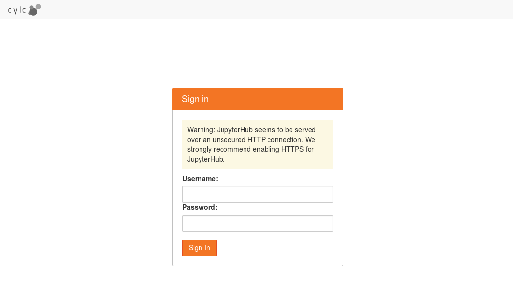
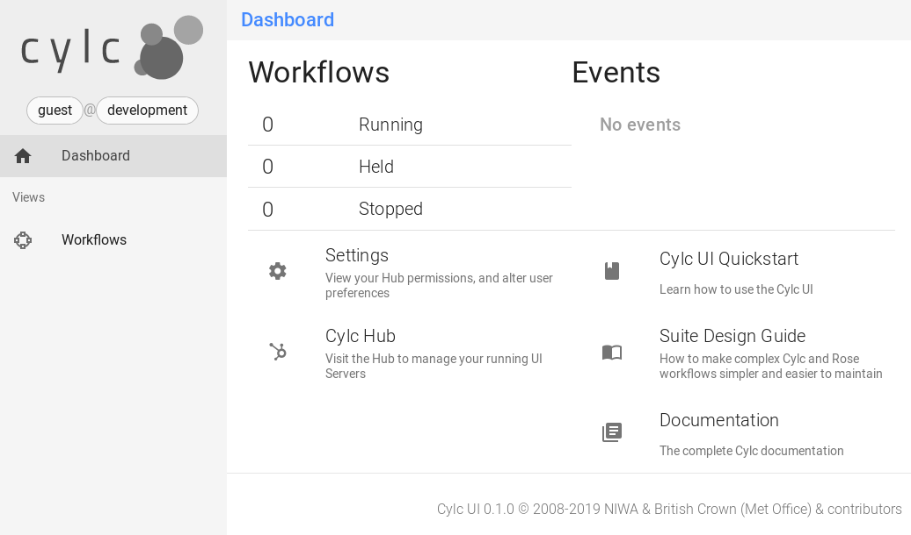
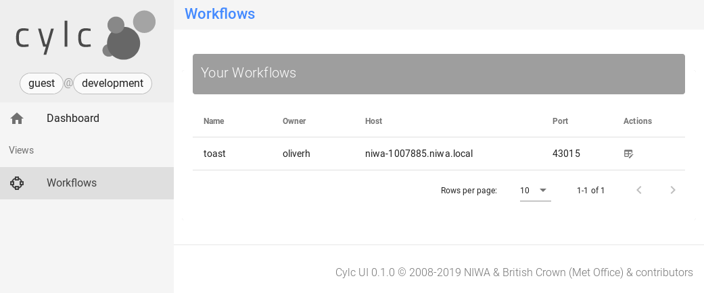
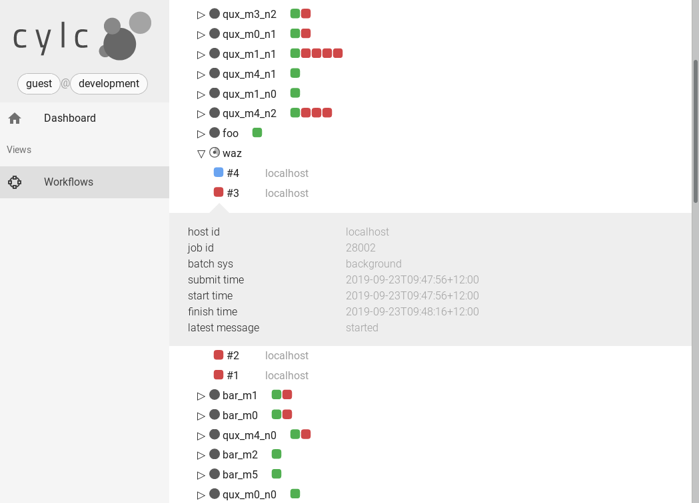

.. _Requirements:

Installation
============

Cylc runs on Linux. It is tested quite thoroughly on modern RHEL and Ubuntu
distros. Some users have also managed to make it work on other Unix variants
including Apple OS X, but they are not officially tested and supported.

Third-Party Software Packages
-----------------------------

.. _GNU Coreutils: https://www.gnu.org/software/coreutils/coreutils.html

Requirements:

- Python 3.7+

  - `python-jose <https://pypi.org/project/python-jose/>`_
  - `zmq <https://pypi.org/project/zmq/>`_
  - `colorama <https://pypi.org/project/colorama/>`_

- `GNU Coreutils`_

  - These must be available in the Cylc environment using the canonical names
    (e.g. ``ls``).

The following packages are necessary for running tests in Cylc:

- `pytest <https://pytest.org>`_

To generate the HTML User Guide, you will need:

- `Sphinx <http://www.sphinx-doc.org/en/master/>`_ 2.0+.

.. TODO: Remove or fix this section once deployment has been sorted.

To check that dependencies are installed and environment is configured
correctly run ``cylc check-software``:

.. code-block:: none

   $ cylc check-software
   Checking your software...

   Individual results:
   ================================================================================
   Package (version requirements)                           Outcome (version found)
   ================================================================================
                                 *REQUIRED SOFTWARE*
   Python (3+).............................FOUND & min. version MET (3.7.2.final.0)
   Python:zmq (any)..................................................FOUND (17.1.2)
   Python:jose (any)..................................................FOUND (2.0.2)
   Python:colorama (any)..............................................FOUND (0.4.1)

                 *OPTIONAL SOFTWARE for the configuration templating*
   Python:EmPy (any)..................................................FOUND (3.3.2)

                    *OPTIONAL SOFTWARE for the HTML documentation*
   Python:sphinx (1.5.3+)..........................FOUND & min. version MET (1.8.4)
   ================================================================================

   Summary:
                             ****************************
                                Core requirements: ok
                                Full-functionality: ok
                             ****************************

If errors are reported then the packages concerned are either not installed or
not in your Python search path.

.. note::

   ``cylc check-software`` has become quite trivial as we've removed or
   bundled some former dependencies, but in future we intend to make it
   print a comprehensive list of library versions etc. to include in with
   bug reports.

To check for specific packages only, supply these as arguments to the
``check-software`` command, either in the form used in the output of
the bare command, without any parent package prefix and colon, or
alternatively all in lower-case, should the given form contain capitals. For
example:

.. code-block:: bash

   $ cylc check-software graphviz Python urllib3

With arguments, check-software provides an exit status indicating a
collective pass (zero) or a failure of that number of packages to satisfy
the requirements (non-zero integer).

.. _InstallCylc:

Installing Cylc
---------------

Cylc releases can be downloaded from `GitHub
<https://cylc.github.io/cylc-flow>`_.

The wrapper script ``usr/bin/cylc`` should be installed to
the system executable search path (e.g. ``/usr/local/bin/``) and
modified slightly to point to a location such as ``/opt`` where
successive Cylc releases will be unpacked side by side.

To install Cylc, unpack the release tarball in the right location, e.g.
``/opt/cylc-7.7.0``, type ``make`` inside the release
directory, and set site defaults - if necessary - in a site global config file
(below).

Make a symbolic link from ``cylc`` to the latest installed version:
``ln -s /opt/cylc-7.7.0 /opt/cylc``. This will be invoked by the
central wrapper if a specific version is not requested. Otherwise, the
wrapper will attempt to invoke the Cylc version specified in
``$CYLC_VERSION``, e.g. ``CYLC_VERSION=7.7.0``. This variable
is automatically set in task job scripts to ensure that jobs use the same Cylc
version as their parent suite server program.  It can also be set by users,
manually or in login scripts, to fix the Cylc version in their environment.

Installing subsequent releases is just a matter of unpacking the new tarballs
next to the previous releases, running ``make`` in them, and copying
in (possibly with modifications) the previous site global config file.

.. _LocalInstall:

Local User Installation
^^^^^^^^^^^^^^^^^^^^^^^

It is easy to install Cylc under your own user account if you don't have
root or sudo access to the system: just put the central Cylc wrapper in
``$HOME/bin/`` (making sure that is in your ``$PATH``) and
modify it to point to a directory such as ``$HOME/cylc/`` where you
will unpack and install release tarballs. Local installation of third party
dependencies like Graphviz is also possible, but that depends on the particular
installation methods used and is outside of the scope of this document.

Create A Site Config File
^^^^^^^^^^^^^^^^^^^^^^^^^

Site and user global config files define some important parameters that affect
all suites, some of which may need to be customized for your site.
See :ref:`SiteAndUserConfiguration` for how to generate an initial site file and
where to install it. All legal site and user global config items are defined
in :ref:`SiteRCReference`.

.. _Configure Site Environment on Job Hosts:

Configure Site Environment on Job Hosts
^^^^^^^^^^^^^^^^^^^^^^^^^^^^^^^^^^^^^^^

Task jobs need access to Cylc on job hosts, to run task message (and other)
Cylc commands. Task job scripts invoke ``bash -l`` (login shells) to run the
job, so sites and users should ensure that their bash login scripts configure
the environment appropriately for access to Cylc. See
:ref:`HowTasksGetAccessToCylc` for more on job environment configuration.

Conda installation
------------------

The ``cylc`` Conda metapackage includes:

- Python 3.7
- cylc-flow-8.0a1 - Python 3 Workflow Service and CLI
- cylc-uiserver-0.1 - Python 3 UI Server component of the Cylc 8 architecture
- cylc-ui-0.1 - Vue.js web UI
- JupyterHub - authenticates users and launches their Cylc UI Servers
- configurable-http-proxy - node.js proxy
- (and all software dependencies of the above)

Current Limitations
^^^^^^^^^^^^^^^^^^^

**Cylc-8.0a1 is an early full-system Cylc 8 preview release**

- It has a fully functional Python 3 workflow service and CLI that can run existing Cylc workflows

**BUT:**

- It is not production-ready yet
  - Use the latest cylc-7.8 release in production
- Do not use it where security is a concern
- The UI includes a prototype "tree view" with no control capability
  - we are working on other views, and controls
- Data update in the UI is via polling at 5 second intervals, and monolithic
  - future releases will use WebSockets and incremental update

Installation
^^^^^^^^^^^^

Create a new Conda environment for Cylc, e.g. ``cylc1``.

::

   $ conda create -n cylc1
   $ conda activate cylc1
   (cylc1) $

Now you can install Cylc on this new environment.

::

   (cylc1) $ conda install cylc

After the command above finishes successfully, you should be able
to run Cylc commands, e.g.:

::

   (cylc1) $ cylc --version
   (cylc1) $ cylc run --no-detach my.suite
   (cylc1) $ cylc-uiserver --help

Usage
^^^^^

Start the Hub (JupyterHub gets installed with the "cylc" package):

::

   (cylc1) $ mkdir -p "${HOME}/srv/cylc/"  # the hub will store session information here
   (cylc1) $ cd "${HOME}/srv/cylc/"
   (cylc1) $ jupyterhub \
      --JupyterHub.spawner_class="jupyterhub.spawner.LocalProcessSpawner" \
      --JupyterHub.logo_file="${CONDA_PREFIX}/work/cylc-ui/img/logo.svg" \
      --Spawner.args="['-s', '${CONDA_PREFIX}/work/cylc-ui']" \
      --Spawner.cmd="cylc-uiserver"

Go to ``http://localhost:8000``, log in to the Hub with your local user
credentials, and enjoy Cylc 8 Alpha-1!

- Start a workflow with the CLI (a good example is shown below)
- Log in at the Hub to authenticate and launch your UI Server

- Note that much of the UI Dashboard is not functional yet. The functional
  links are:
  - Cylc Hub
  - Suite Design Guide (web link)
  - Documentation (web link)

- In the left side-bar, click on Workflows to view your running workflows
- In the workflows view, click on icons under "Actions" to view the
  corresponding workflow.

- In the tree view:
  - click on task names to see the list of task jobs
  - click on job icons to see the detail of a specific job

To deactivate and/or remove the conda environment:

::

   (cylc1) $ conda deactivate
   $ conda env remove -n cylc1

An Example Workflow to View
^^^^^^^^^^^^^^^^^^^^^^^^^^^

The following workflow generates a bunch of tasks that initially
fail before succeeding after a random number of retries (this shows
the new "Cylc 8 task/job separation" nicely):

::

   [cylc]
      cycle point format = %Y
      [[parameters]]
         m = 0..5
         n = 0..2
   [scheduling]
      initial cycle point = 3000
      [[graph]]
         P1Y = "foo[-P1Y] => foo => bar<m> => qux<m,n> => waz"
   [runtime]
      [[root]]
         script = """
            sleep 20
            # fail 50% of the time if try number is less than 5
            if (( CYLC_TASK_TRY_NUMBER < 5 )); then
              if (( RANDOM % 2 < 1 )); then
                 exit 1
              fi
            fi"""
         [[[job]]]
            execution retry delays = 6*PT2S
