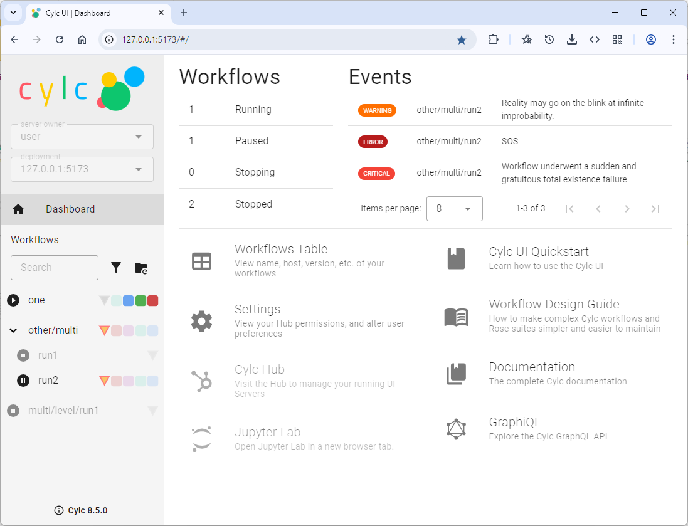

.. _overview:

What's New in Cylc 8.0b0?
=========================

**A quick guide for Cylc 7 users.**

.. tip::

   If you need help using Cylc 8 please post questions to the
   `Cylc Forum <https://cylc.discourse.group/>`_

Cylc 8 differs from Cylc 7 in many ways: architecture, scheduling
algorithm, security, UIs, and working practices, and more.

Backward Compatibility
----------------------

To make the transition easier, Cylc 8 can run Cylc 7 workflows out of the box.

.. warning::

   But please take action on any deprecation warnings.

Terminology and Config File Name
--------------------------------

- *suite* is now **workflow** - a more widely understood term
   - the ``suite.rc`` config file is now ``flow.cylc``
   - *suite daemon* (or *suite server program*) is now **scheduler**
- *batch system* is now **job runner**
   - our job runners are not all "batch systems"

Architecture
------------

Cylc has been re-architected to support a remote web UI:

- a new Hub component, where you authenticate
  - can run as a regular or privileged user

- a new UI Server component that runs as the user

- new network layers to feed scheduler and filesystem data to the UI Server and UI
  - efficient incremental push updates (c.f. polled global updates in Cylc 7)

- a new in-browser UI
  - a front dashboard page with documentation links (etc.)
  - integrated gscan side-panel
  - responsive web design (from desktop to table to mobile)
  - a tabbed interface to display multiple workflow views
  - command integration, for interacting with task, jobs, and schedulers

- a new terminal UI (TUI) as part of the CLI

.. image:: img/hub.png
   :align: center

.. image:: img/cylc-ui-tree.png
   :align: center

.. image:: img/cylc-tui.png
   :align: center

Scheduling Algorithm
--------------------

Cylc has to be able to manage infinite workflows of repeating tasks:

.. image:: img/cycling.png
   :align: center

See :ref:`Cylc 7 Scheduling Deficiencies Fixed by Cylc 8`

Cylc 8 hsa an efficient new **Spawn on Demand scheduler** which,
- only needs to be aware of current active tasks, and what comes next
- no implicit dependence on previous-instance job submit
- handles alternate path branching without the need for suicide triggers
- can run tasks out of cycle point order
- enables a sensible active-task based window on the evolving workflow

It also supports a powerful new capability called **reflow** (you can trigger
multiple "wavefronts" of activity at once, in the same workflow graph). And
users no longer need to know about the "scheduler task pool" or "insertion"
of task proxy objects into it (the ``cylc insert`` and ``cylc reset`` commands are
gone).

Task/Job Separation and Task States
-----------------------------------

A "task" represents a node in your abstract workflow graph. A job is a real
process that runs on a computer. Tasks can submit multiple jobs to run, through
automatic retries or manual re-triggering.

Cylc 7 had 13 task/job states. The GUI only showed tasks, with job data
from the latest task job.

Cylc 8 has only 8 task/job states. The Cylc 8 UI shows both task and jobs.
Task icons are monochrome circles; job icons are coloured squares. The running
task icon incorporates a radial progress indicator.

.. image:: img/task-job.png
   :align: center

Most of the missing Cylc 7 task states are now just plain old *waiting*, but
you can now see or infer what the task is waiting on: a queue, xtrigger, or
retry timer. For instance, a waiting task that already has one or more jobs
must be about to retry.

Window on the Workflow
----------------------

.. image:: img/n-window.png
   :align: center

The Cylc UI can't show "all the tasks" at once because the graph may be huge,
or even infinite in extent in cycling systems. The Cylc 8 UI shows:

- current **active tasks** (submitted, running, unhandled-failed)
  - plus waiting tasks that are only waiting on non-task dependencies: queues,
  runahead limit, clock-triggers, or xtriggers

- tasks up to ``n`` graph edges away from active tasks (default ``1`` edge) 

Platform Awareness
------------------

Cylc 7 was aware of individual job hosts.

.. code-block:: cylc

   [runtime]
      [[model]]
          [[[remote]]]  # Deprecated Cylc 7
              host = hpc1.login.1

Cylc 8 is aware of sets of host settings, specified as *platforms*
in global configuration. By definition platform hosts share a file
system and job runner: If one host is unavailable Cylc 8 can use
other hosts on the same platform to interact with task jobs.

.. code-block:: cylc

   [runtime]
      [[model]]
          platform = hpc1  # Cylc 8
      [[model_cleanup]]
          # Platforms can have the same hosts with different job runners.
          platform = hpc1_background

Graph Syntax
------------

Cylc 7 had unnecessarily deep nesting of graph config sections:

.. code-block:: cylc

   [scheduling]
      initial cycle point = now
      [[dependencies]]  # Deprecated Cylc 7
          [[[R1]]]
              graph = "prep => foo"
          [[[R/^/P1D]]]
              graph = "foo => bar => baz"

Cylc 8 cleans this up:

.. code-block:: cylc

   [scheduling]
      initial cycle point = now
      [[graph]]  # Cylc 8
          R1 = "prep => foo"
          R/^/P1D = "foo => bar => baz"

Workflow Installation
---------------------

The functionality of ``rose suite-run`` has been migrated into Cylc 8. This
cleanly separates workflow source directory from run directory, and installs
workflow files into the run directory at start-up

- `cylc install` copies all workflow source files into a dedicated
  run-directory
- each new install creates a new numbered run-directory (by default)
- (workflow files are automatically installed onto job platforms too)

.. code-block:: bash

   (venv) $ pwd
   /home/oliverh/cylc-src/democ8

   (venv) $ cylc install
   INSTALLED democ8 from /home/oliverh/cylc-src/democ8 -> /home/oliverh/cylc-run/democ8/run1

   (venv) $ cylc play democ8/run1
                ._.
                | |
    ._____._. ._| |_____.
    | .___| | | | | .___|       The Cylc Workflow Engine [8.0b0]
    | !___| !_! | | !___.           Copyright (C) 2008-2021 NIWA
    !_____!___. |_!_____!   & British Crown (Met Office) & Contributors.
          .___! |
          !_____!

   ...

   (venv) $ cylc install
   INSTALLED democ8 from /home/oliverh/cylc-src/democ8 -> /home/oliverh/cylc-run/democ8/run2

   (venv) $ cylc play democ8/run2
   # etc.

Safe Run Semantics
------------------

Cylc 7 run semantics were dangerous: if you accidentally typed `cylc run`
instead of ``cylc restart`` a new from-scratch run would overwrite the existing
run directory, including the run database, so that you could not go back and do
the intended restart.

Cylc 8 has ``cylc play`` to *start*, *restart*, or *unpause* a workflow, so
"restart" is now the safe default behaviour. For a new run from scratch,
do a fresh ``cylc install`` and run it safely in the new run directory.

Security
--------

- Users authenticate at the Hub, with site-appropriate authentication plugins
- The Hub spawns a UI Server as the target user (workflow owner). This UI
  Server interacts with its own schedulers and authorizes access to them
  according to the privileges granted to the authenticated user
  - (the UI Server and Schedulers run as the workflow-owner user)
- Jobs authenticate to their parent scheduler using
  `CurveZMQ <http://curvezmq.org/>`_

.. note::

   The authorization system is still in development; for the moment you can
   only interact with your own workflows.

Packaging
---------

Cylc 7 had to be installed by unpacking a release tarball and ensuring
that many software dependencies were also installed on the system.

Cylc 8 can be installed from **Conda Forge**, into a conda environment:

.. code-block:: bash

   $ conda create -n cylc8 python=3.8
   $ conda activate cylc8
   (cylc8) $ conda install cylc
   (cylc8) $ cylc --version
   cylc-8.0b0

Or from **PyPI**, into a Python 3 virtual environment, by `pip`-installing the
UI Server component, which pulls in cylc-flow (Scheduler and CLI) as a
dependency, and includes a built copy of cylc-ui (Javascript UI):

.. code-block:: bash

   $ python3 -m venv venv
   $ . venv/bin/activate
   (venv) $ pip install cylc-uiserver
   (venv) $ cylc --version
   cylc-8.0b0

The following dependencies are installed by Conda but not by pip:

- `configurable-http-proxy` (used by the Hub)
- Python

The following dependencies are not installed by Conda or pip:

- `bash`
- GNU `coreutils`
- `mail` (for automated email functionality)

What's Still Missing From Cylc 8?
---------------------------------

Some major features still in progress or yet to be started:

- Other UI workflow views:
   - graph view
   - table view
   - dot view
- Static graph visualization
- UI view workflow and job logs
   - for the moment, go to the job log directories or use cylc-7.9.3/7.8.8 Cylc
     Review to view Cylc 8 logs
- UI "edit run"
- Cross-user functionality
- UI Server fine-grained authorization
- The User Guide has not been completely overhauled yet
- UI Server services to:
   - Install new workflows
   - Start stopped workflows

- UI Server to populate historic task data from run DBs
- Efficient delta-driven TUI

.. _Cylc 7 Scheduling Deficiencies Fixed by Cylc 8:

Cylc 7 Scheduling Deficiencies Fixed by Cylc 8
----------------------------------------------

- Every task implicitly depedended on previous-instance (same task, previous
  cycle point) job submission
- The scheduler had to be aware of at least one active and one waiting instance
  of every task in the workflow, plus all succeeded tasks in the current
  active task window
- The indiscriminate dependency matching process was costly
- To fully understand what tasks appeared in the GUI (why particular
  *waiting* or *succeeded* tasks appeared in some cycles but not in others, for
  instance) you had to understand the scheduling algorithm
- *Suicide triggers* were needed to clear unused graph paths and avoid stalling
  the scheduler
- Tasks could not run out of cycle point order
- The scheduler could stall with next-cycle-point successors not spawned
  downstream of failed tasks
