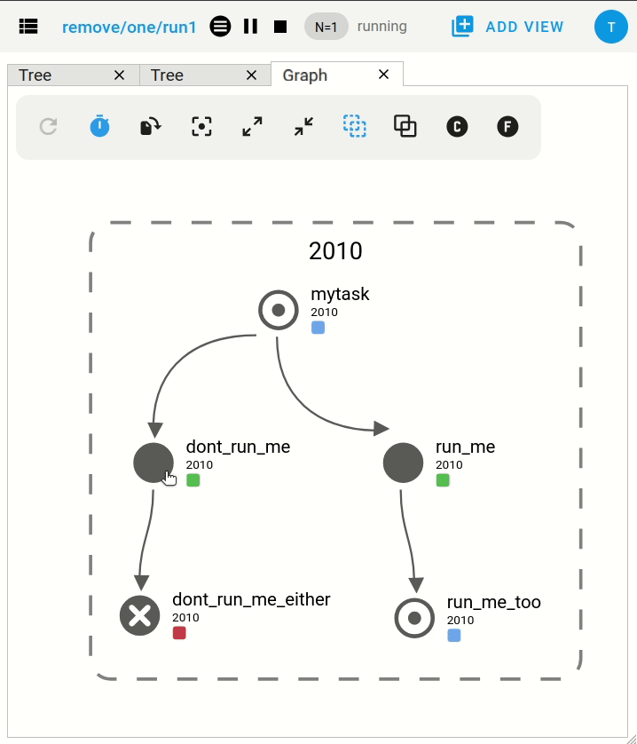
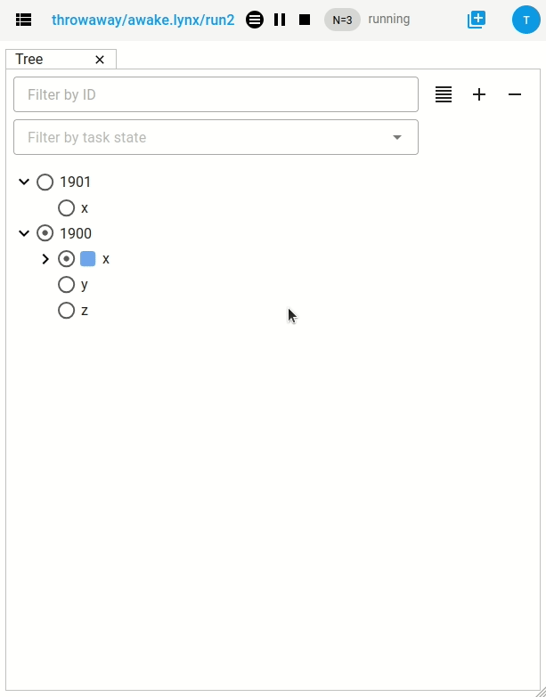
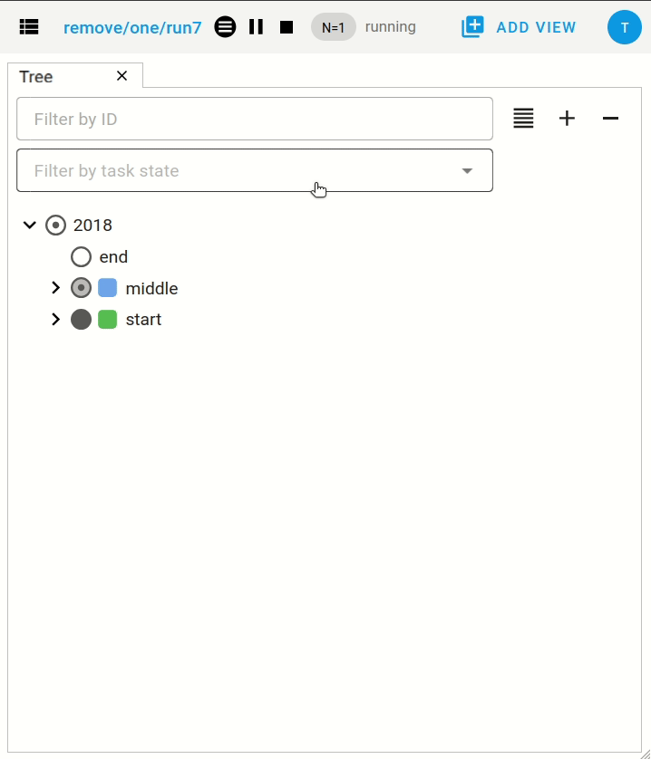
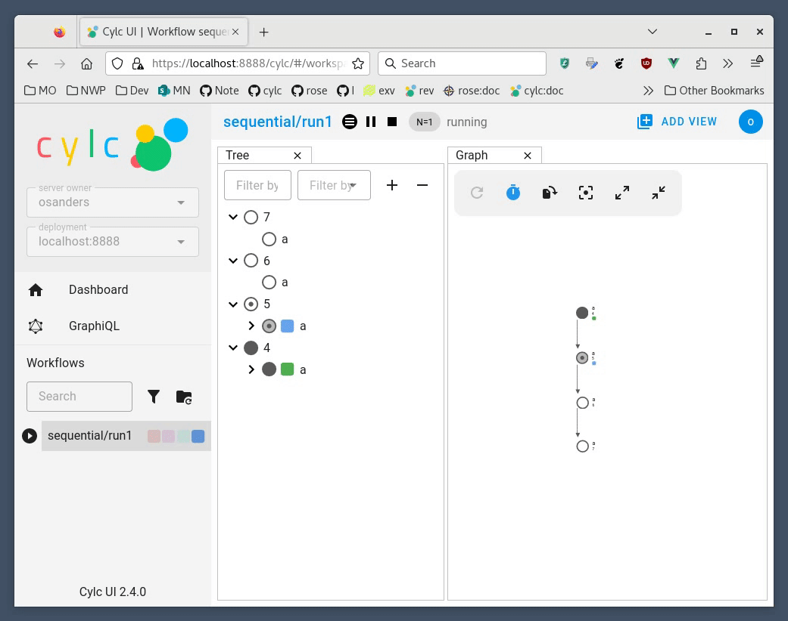
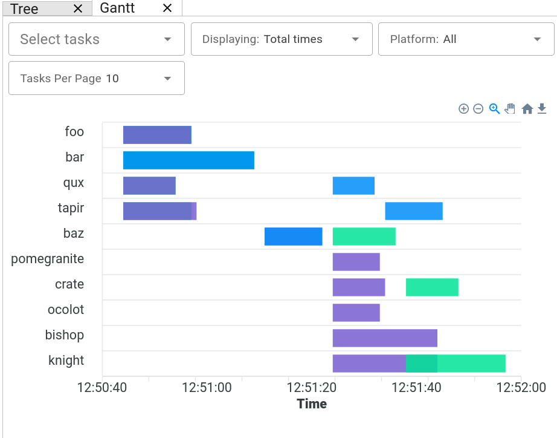
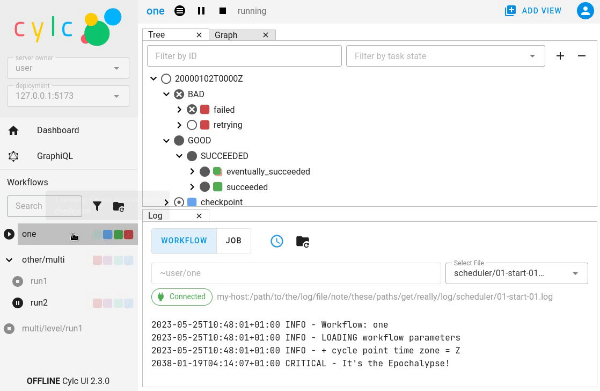
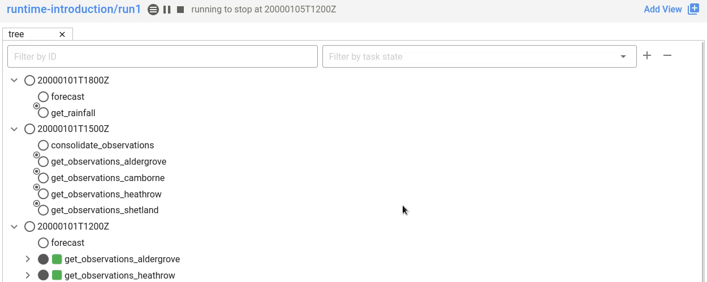

Changes
=======

.. _cylc-flow-changelog: https://github.com/cylc/cylc-flow/blob/master/CHANGES.md
.. _cylc-uiserver-changelog: https://github.com/cylc/cylc-uiserver/blob/master/CHANGES.md
.. _cylc-ui-changelog: https://github.com/cylc/cylc-ui/blob/master/CHANGES.md
.. _cylc-rose-changelog: https://github.com/cylc/cylc-rose/blob/master/CHANGES.md
.. _metomi-rose-changelog: https://github.com/metomi/rose/blob/master/CHANGES.md
.. _metomi-isodatetime-changelog: https://github.com/metomi/isodatetime/blob/master/CHANGES.md

This page contains a summary of significant changes across all Cylc components for each
release.

For more detail see the component changelogs:

* `cylc-flow-changelog`_
* `cylc-uiserver-changelog`_
* `cylc-ui-changelog`_
* `cylc-rose-changelog`_
* `metomi-rose-changelog`_
* `metomi-isodatetime-changelog`_

----------

Cylc 8.4
--------

.. admonition:: Cylc Components
   :class: hint

   :cylc-flow: `8.4 <https://github.com/cylc/cylc-flow/blob/master/CHANGES.md>`__
   :cylc-ui: `2.7 <https://github.com/cylc/cylc-ui/blob/master/CHANGES.md>`__
   :cylc-uiserver: `1.6 <https://github.com/cylc/cylc-uiserver/blob/master/CHANGES.md>`__
   :cylc-rose: `1.5 <https://github.com/cylc/cylc-rose/blob/master/CHANGES.md>`__
   :rose: `2.4 <https://github.com/metomi/rose/blob/master/CHANGES.md>`__

Cylc Remove
^^^^^^^^^^^

Cylc Remove now allows removing tasks which are no longer active, making
it look like they never ran. Removing a running task will now kill that task.

The ``cylc remove`` command now has the ``--flow`` option, allowing removal
of a task from specific flows.

Tasks removed from all flows are retained in the workflow database with
``flow=none`` for provenance.

.. seealso::

   See :ref:`interventions.remove_tasks` to see an example of this feature in
   action.

Skip Mode
^^^^^^^^^

Tasks can now be run in "skip" mode where they complete
their required outputs instantly.
Tasks can be configured to run in skip mode either in the workflow configuration
or by broadcasting.

``cylc set --out skip`` will set outputs for a task as if the task has run
in skip mode. The task outputs delivered by skip mode can be customized using
:cylc:conf:`[runtime][<namespace>][skip]outputs` or defaults to behaviour
described in :ref:`skip_mode.task_outputs`.

This can be used to skip a cycle or a task (for a full example see :ref:`interventions.skip_cycle`).

It may also be useful for :ref:`EfficientInterFamilyTriggering` and
for :ref:`skip_mode.parameter_exclusion`.

.. seealso::

   :ref:`task-run-modes.skip`

Trigger When Paused
^^^^^^^^^^^^^^^^^^^

Tasks can now be triggered and will run immediately while the workflow
is paused.

.. seealso::

   :ref:`interventions.trigger_while_paused` for an example of this feature.

EmPy Support Removed
^^^^^^^^^^^^^^^^^^^^

Support for the EmPy template processor (an alternative to Jinja2) has been
removed.

Info View
^^^^^^^^^

An info view has been added, displaying

* :cylc:conf:`[runtime][<namespace>][meta]`.
* :ref:`task ouputs<required outputs>`.
* Task :term:`prerequisite`.
* Task :term:`output completion condition`.

.. image:: changes/cylc-gui-info-view.gif
   :width: 80%

Cylc 8.3
--------

.. admonition:: Cylc Components
   :class: hint

   :cylc-flow: `8.3 <https://github.com/cylc/cylc-flow/blob/master/CHANGES.md>`__
   :cylc-ui: `2.5 <https://github.com/cylc/cylc-ui/blob/master/CHANGES.md>`__
   :cylc-uiserver: `1.5 <https://github.com/cylc/cylc-uiserver/blob/master/CHANGES.md>`__
   :cylc-rose: `1.4 <https://github.com/cylc/cylc-rose/blob/master/CHANGES.md>`__
   :rose: `2.3 <https://github.com/metomi/rose/blob/master/CHANGES.md>`__

Manually setting task outputs and prerequisites
^^^^^^^^^^^^^^^^^^^^^^^^^^^^^^^^^^^^^^^^^^^^^^^

At Cylc 8.3.0, the ``cylc set-outputs`` command has been replaced by the new
``cylc set`` command.

The ``cylc set-outputs`` command made it look like an output had been generated
to downstream tasks, but did not update the task status to match. As a result,
it was often necessary to use ``cylc remove`` in combination with ``cylc
set-outputs``.

The new ``cylc set`` command is able to directly set task outputs as if they
had completed naturally, making the command more intuitive and avoiding the
need for ``cylc remove``. It can also set prerequisites, as if they were satisfied naturally.

For example, say there's a failed task holding up your workflow and you want
Cylc to continue as if the task had succeeded. Here are the interventions
you would need to perform with Cylc 8.2 and 8.3 side-by-side.

.. list-table::
   :class: grid-table
   :widths: 50 50

   * - **Cylc 8.2** (set-outputs)
     - **Cylc 8.3** (set)
   * - .. code-block:: bash

          # let downstream tasks run:
          cylc set-outputs <task>
          # remove the failed task:
          cylc remove <task>

     - .. code-block:: bash

          # tell Cylc that the task succeeded:
          cylc set <task>

   * - .. image:: changes/cylc-set-outputs.gif
          :align: center
          :width: 100%

     - .. image:: changes/cylc-set.gif
          :align: center
          :width: 100%

Tui
^^^

The Tui (terminal user interface) is a command line version of the Gui.
You can use it to monitor and control your workflows.

There has been a major update to Tui at Cylc 8.3.0:

* Larger workflows will no longer cause Tui to time out.
* You can now browse all your workflows including stopped workflows.
* You can monitor multiple workflows at the same time.
* The workflow and job logs are now available from within Tui.

.. image:: changes/tui-1.gif
   :width: 100%

N-Window selector in the GUI
^^^^^^^^^^^^^^^^^^^^^^^^^^^^

The :term:`n-window` determines how much of a workflow is visible in the GUI / Tui.

The ``n=0`` window contains only the active tasks
(i.e. queued, preparing, submitted or running tasks).

The ``n=1`` window, also contains tasks one "edge" out from active tasks
(i.e. the tasks immediately upstream or downstream of active tasks).

The ``n=2`` window, also contains tasks two "edges" out from active tasks,
and so on.

It is now possible to change the window extent in the GUI via a button in the
toolbar allowing you to see tasks further back in the workflow's history.

.. note::

   This is currently a per-workflow setting so changing the n-window in one
   browser tab will also change it in other browser tabs and Tui sessions.

.. warning::

   Using high n-window values with complex workflows may have performance
   impacts.

Group by cycle point in the graph view
^^^^^^^^^^^^^^^^^^^^^^^^^^^^^^^^^^^^^^

The graph view now has an option to group tasks by cycle point.

.. image:: changes/cylc-graph-group-by-cycle-point.png
   :width: 100%

Gantt View
^^^^^^^^^^

The GUI now has a `Gantt <https://en.wikipedia.org/wiki/Gantt_chart>`_ view option:

Analysis View
^^^^^^^^^^^^^

New Analysis added - a layout which plots run times against cycle points.

.. image:: changes/time_series.png
   :width: 100%
   :alt: A picture of the Time Series task analysis in operation.

Completion Expressions
^^^^^^^^^^^^^^^^^^^^^^

When a task achieves a final status, its outputs are validated against a "completion
expression" to ensure that it has produced all of its
:term:`required outputs <required output>`.
If a task fails this validation check it is said to have "incomplete outputs"
and will be retained in the :term:`active window` pending user intervention.

This completion expression is generated automatically from the graph.
By default, tasks are expected to succeed, if you register any additional
required output in the graph, then these must also
be produced.

At Cylc 8.3.0 it is now possible to manually configure this completion
expression for finer control. This is particularly useful for anyone using
:term:`custom outputs <custom output>`.

For example, ``mytask`` must produce one of the outputs ``x`` or ``y`` to pass
the completion expression configured here:

.. code-block:: cylc

   [runtime]
       [[mytask]]
           completion = succeeded and (x or y)
           [[[outputs]]]
               x = output-x
               y = output-y

For more information, see the reference for the
:cylc:conf:`[runtime][<namespace>]completion` configuration.

Workflow State Triggers & Commands
^^^^^^^^^^^^^^^^^^^^^^^^^^^^^^^^^^

Workflow state xtriggers and command now take Cylc universal IDs instead of
separate arguments:

For example, you can (and should) now write:

.. code-block:: diff

   # On the command line
   - cylc workflow-state my-workflow --point 20240101 --task mytask --message "succeeded"
   + cylc workflow-state my-workflow//20240101/mytask:succeeded --triggers

   # In the flow.cylc file
   - my_xtrigger = workflow_state(
   -     workflow="my-workflow",
   -     task="mytask",
   -     point="20240101",
   -     message="succeeded"
   - )
   + my_xtrigger = workflow_state('my-workflow//20240101/mytask:succeeded', is_trigger=True)

.. important::

   The new workflow state trigger syntax can use either the trigger or message from
   ``trigger=message`` in :cylc:conf:`[runtime][<namespace>][outputs]`.

   The trigger and message are the same for the most common use cases (``succeeded`` and ``started``)
   but may differ for other outputs, namely :term:`custom outputs <custom output>`.

.. note::

   The ``suite-state`` xtrigger has been reimplemented for compatibility with
   Cylc 7 workflows.

----------

Cylc 8.2
--------

.. admonition:: Cylc Components
   :class: hint

   :cylc-flow: `8.2 <https://github.com/cylc/cylc-flow/blob/8.2.x/CHANGES.md>`__
   :cylc-uiserver: `1.4 <https://github.com/cylc/cylc-uiserver/blob/1.4.x/CHANGES.md>`__
   :cylc-rose: `1.3 <https://github.com/cylc/cylc-rose/blob/1.3.x/CHANGES.md>`__

UI now remembers workspace tab layout
^^^^^^^^^^^^^^^^^^^^^^^^^^^^^^^^^^^^^

.. versionadded:: cylc-uiserver 1.4.4

The UI now remembers the layout of your workspace tabs when you navigate away
from that workflow. Note that this only applies per browser session.

Cylc ignores ``$PYTHONPATH``
^^^^^^^^^^^^^^^^^^^^^^^^^^^^

Cylc now ignores ``$PYTHONPATH`` to make it more robust to task
environments which set this value. If you want to add to the Cylc
environment itself, e.g. to install a Cylc extension,
use a custom xtrigger, or event handler use ``$CYLC_PYTHONPATH``.

Upgrade To The Latest Jupyter Releases
^^^^^^^^^^^^^^^^^^^^^^^^^^^^^^^^^^^^^^

.. versionadded:: cylc-uiserver 1.4.0

The Cylc UI Server has been updated to work with the latest releases of
`Jupyter Server`_ and `Jupyter Hub`_.

If you are utilising Cylc's multi-user functionality then your configuration
will require some changes to work with these releases.

See :ref:`cylc.uiserver.multi-user` for more details

.. versionadded:: cylc-uiserver 1.3.0

You can now configure the view which is opened by default when you navigate to
a new workflow in the GUI. Navigate to the settings page to select your chosen
view.

.. image:: changes/ui-view-selector.jpg
   :width: 100%

In the future we plan to support configuring a layout of multiple views and
configuring certain options on those views.

Reload
^^^^^^

.. versionadded:: cylc-flow 8.2.0

When workflows are
:ref:`reloaded <Reloading The Workflow Configuration At Runtime>`,
(e.g. by ``cylc reload``), Cylc will now pause the workflow and wait for any
preparing tasks to be submitted before proceeding with the reload.
Once the reload has been completed, the workflow will be resumed.

You can now see more information about the status of the reload in the
workflow status message which appears at the top of the GUI and Tui interfaces.

----------

Cylc 8.1
--------

.. admonition:: Cylc Components
   :class: hint

   :cylc-flow: `8.1 <https://github.com/cylc/cylc-flow/blob/8.1.x/CHANGES.md>`__
   :cylc-uiserver: `1.2 <https://github.com/cylc/cylc-uiserver/blob/1.2.x/CHANGES.md>`__
   :cylc-rose: `1.1 <https://github.com/cylc/cylc-rose/blob/1.1.0/CHANGES.md#user-content-cylc-rose-110-released-2022-07-28>`__

.. warning::

   Workflows started with Cylc 8.0 which contain multiple :term:`flows <flow>`
   **cannot** be restarted with Cylc 8.1 due to database changes.

Analysis View
^^^^^^^^^^^^^

.. versionadded:: cylc-uiserver 1.2.2

The web UI also has a new view for displaying task queue & run time statistics.

Graph View
^^^^^^^^^^

.. versionadded:: cylc-uiserver 1.2.0

The web UI now has a graph view which displays a visualisation of a workflow's graph:

.. image:: changes/cylc-graph.gif
   :width: 80%

Family & cycle grouping as well as the ability to view graphs for stopped workflows
will be added in later releases.

Log View
^^^^^^^^

.. versionadded:: cylc-uiserver 1.2.0

The web UI now has a log view which displays workflow and job log files:

.. image:: changes/log-view-screenshot.png
   :width: 80%

Support for viewing more log files, syntax highlighting, searching and line
numbers are planned for future releases.

Edit Runtime
^^^^^^^^^^^^

.. versionadded:: cylc-uiserver 1.2.0

The web UI now has a command for editing the :cylc:conf:`[runtime]` section
of a task or family.

.. image:: changes/edit-runtime-screenshot.png
   :width: 80%

Any changes made are :ref:`broadcast <cylc-broadcast>` to the running workflow.

Combined Commands
^^^^^^^^^^^^^^^^^

.. versionadded:: cylc-flow 8.1.0

Two new commands have been added as short-cuts for common working patterns:

``cylc vip``
   Validate, install and plays a workflow, equivalent to:

   .. code-block:: bash

      cylc validate <path>
      cylc install <path>
      cylc play <id>

``cylc vr``
   Validate and reinstall a workflow, then either:
   - reload the workflow if it is running.
   - restart the workflow if it is stopped.

.. image:: changes/vip-vr.gif
   :width: 100%

For more information see the command line help:

.. code-block:: bash

   cylc vip --help
   cylc vr --help

Bash Completion
^^^^^^^^^^^^^^^

.. versionadded:: cylc-flow 8.1.0

Cylc now provides a high performance Bash completion script which saves you typing:

* Cylc commands & options
* Workflow IDs
* Cycle points
* Task names
* Job numbers

.. image:: changes/cylc-completion.bash.gif
   :width: 80%

:ref:`Installation instructions <installation.shell_auto_completion>`.

----------

Cylc 8.0
--------

.. admonition:: Cylc Components
   :class: hint

   :cylc-flow: `8.0 <https://github.com/cylc/cylc-flow/blob/8.0.0/CHANGES.md#user-content-major-changes-in-cylc-8>`__
   :cylc-uiserver: `1.1 <https://github.com/cylc/cylc-uiserver/blob/1.1.0/CHANGES.md#user-content-cylc-uiserver-110-released-2022-07-28>`__
   :cylc-rose: `1.1 <https://github.com/cylc/cylc-rose/blob/1.1.0/CHANGES.md#user-content-cylc-rose-110-released-2022-07-28>`__

The first official release of Cylc 8.

For a summary of changes see the :ref:`migration guide<728.overview>`.
