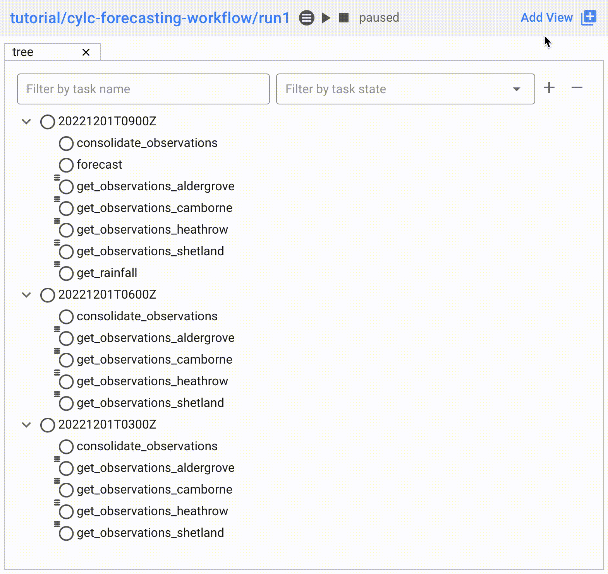

Changes
=======

.. _cylc-flow-changelog: https://github.com/cylc/cylc-flow/blob/master/CHANGES.md
.. _cylc-uiserver-changelog: https://github.com/cylc/cylc-uiserver/blob/master/CHANGES.md
.. _cylc-ui-changelog: https://github.com/cylc/cylc-ui/blob/master/CHANGES.md
.. _cylc-rose-changelog: https://github.com/cylc/cylc-rose/blob/master/CHANGES.md
.. _metomi-rose-changelog: https://github.com/metomi/rose/blob/master/CHANGES.md
.. _metomi-isodatetime-changelog: https://github.com/metomi/isodatetime/blob/master/CHANGES.md

This page contains a summary of significant changes across all Cylc components for each
release.

For more detail see the component changelogs:

* `cylc-flow-changelog`_
* `cylc-uiserver-changelog`_
* `cylc-ui-changelog`_
* `cylc-rose-changelog`_
* `metomi-rose-changelog`_
* `metomi-isodatetime-changelog`_

----------

Cylc 8.3.0
----------

.. admonition:: Cylc Components
   :class: hint

   TODO

..
   Uncomment this before 8.3.0 release

   :cylc-flow: `8.3 <https://github.com/cylc/cylc-flow/blob/8.3.x/CHANGES.md>`__
   :cylc-uiserver: `1.4 <https://github.com/cylc/cylc-uiserver/blob/1.4.x/CHANGES.md>`__
   :cylc-rose: `1.4 <https://github.com/cylc/cylc-rose/blob/1.4.x/CHANGES.md>`__

Cylc ignores ``$PYTHONPATH``
^^^^^^^^^^^^^^^^^^^^^^^^^^^^

Cylc now ignores ``$PYTHONPATH`` to make it more robust to task
environments which set this value. If you want to add to the Cylc
environment itself, e.g. to install a Cylc extension,
use a custom xtrigger, or event handler use ``$CYLC_PYTHONPATH``.

Upgrade To The Latest Jupyter Releases
^^^^^^^^^^^^^^^^^^^^^^^^^^^^^^^^^^^^^^

The Cylc UI Server has been updated to work with the latest releases of
`Jupyter Server`_ and `Jupyter Hub`_.

If you are utilising Cylc's multi-user functionality then your configuration
will require some changes to work with these releases.

See :ref:`cylc.uiserver.multi-user` for more details

----------

Cylc 8.2.0
----------

.. admonition:: Cylc Components
   :class: hint

   :cylc-flow: `8.2 <https://github.com/cylc/cylc-flow/blob/master/CHANGES.md>`__
   :cylc-uiserver: `1.3 <https://github.com/cylc/cylc-uiserver/blob/master/CHANGES.md>`__
   :cylc-rose: `1.3 <https://github.com/cylc/cylc-rose/blob/master/CHANGES.md>`__

Configure The Default View
^^^^^^^^^^^^^^^^^^^^^^^^^^

You can now configure the view which is opened by default when you navigate to
a new workflow in the GUI. Navigate to the settings page to select your chosen
view.

.. image:: changes/ui-view-selector.jpg
   :width: 100%

In the future we plan to support configuring a layout of multiple views and
configuring certain options on those views.

Reload
^^^^^^

When workflows are
:ref:`reloaded <Reloading The Workflow Configuration At Runtime>`,
(e.g. by ``cylc reload``), Cylc will now pause the workflow and wait for any
preparing tasks to be submitted before proceeding with the reload.
Once the reload has been completed, the workflow will be resumed.

You can now see more information about the status of the reload in the
workflow status message which appears at the top of the GUI and Tui interfaces.

----------

Cylc 8.1.0
----------

.. admonition:: Cylc Components
   :class: hint

   :cylc-flow: `8.1 <https://github.com/cylc/cylc-flow/blob/8.1.x/CHANGES.md>`__
   :cylc-uiserver: `1.2 <https://github.com/cylc/cylc-uiserver/blob/1.2.x/CHANGES.md>`__
   :cylc-rose: `1.1 <https://github.com/cylc/cylc-rose/blob/1.1.0/CHANGES.md#user-content-cylc-rose-110-released-2022-07-28>`__

.. warning::

   Workflows started with Cylc 8.0 which contain multiple :term:`flows <flow>`
   **cannot** be restarted with Cylc 8.1 due to database changes.

Graph View
^^^^^^^^^^

The web UI now has a graph view which displays a visualisation of a workflow's graph:

Family & cycle grouping as well as the ability to view graphs for stopped workflows
will be added in later releases.

Log View
^^^^^^^^

The web UI now has a log view which displays workflow and job log files:

.. image:: changes/log-view-screenshot.png
   :width: 80%

Support for viewing more log files, syntax highlighting, searching and line
numbers are planned for future releases.

Edit Runtime
^^^^^^^^^^^^

The web UI now has a command for editing the :cylc:conf:`[runtime]` section
of a task or family.

.. image:: changes/edit-runtime-screenshot.png
   :width: 80%

Any changes made are :ref:`broadcast <cylc-broadcast>` to the running workflow.

Analysis View
^^^^^^^^^^^^^

.. versionadded:: cylc-uiserver 1.2.2

The web UI also has a new view for displaying task queue & run time statistics.

.. image:: changes/analysis_view.gif
   :width: 80%

Combined Commands
^^^^^^^^^^^^^^^^^

Two new commands have been added as short-cuts for common working patterns:

``cylc vip``
   Validate, install and plays a workflow, equivalent to:

   .. code-block:: bash

      cylc validate <path>
      cylc install <path>
      cylc play <id>

``cylc vr``
   Validate and reinstall a workflow, then either:
   - reload the workflow if it is running.
   - restart the workflow if it is stopped.

.. image:: changes/vip-vr.gif
   :width: 100%

For more information see the command line help:

.. code-block:: bash

   cylc vip --help
   cylc vr --help

Bash Completion
^^^^^^^^^^^^^^^

Cylc now provides a high performance Bash completion script which saves you typing:

* Cylc commands & options
* Workflow IDs
* Cycle points
* Task names
* Job numbers

.. image:: changes/cylc-completion.bash.gif
   :width: 80%

:ref:`Installation instructions <installation.shell_auto_completion>`.

----------

Cylc 8.0.0
----------

.. admonition:: Cylc Components
   :class: hint

   :cylc-flow: `8.0 <https://github.com/cylc/cylc-flow/blob/8.0.0/CHANGES.md#user-content-major-changes-in-cylc-8>`__
   :cylc-uiserver: `1.1 <https://github.com/cylc/cylc-uiserver/blob/1.1.0/CHANGES.md#user-content-cylc-uiserver-110-released-2022-07-28>`__
   :cylc-rose: `1.1 <https://github.com/cylc/cylc-rose/blob/1.1.0/CHANGES.md#user-content-cylc-rose-110-released-2022-07-28>`__

The first official release of Cylc 8.

For a summary of changes see the :ref:`migration guide<728.overview>`.
