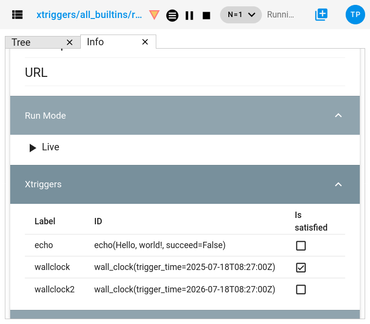
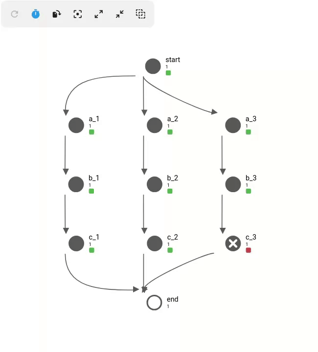
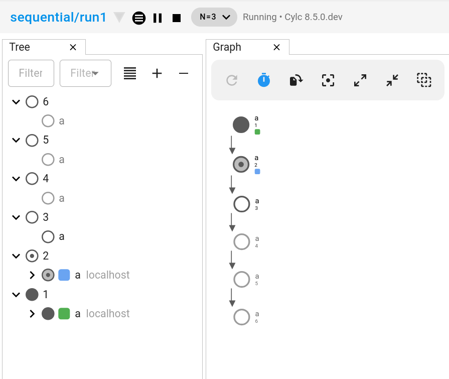
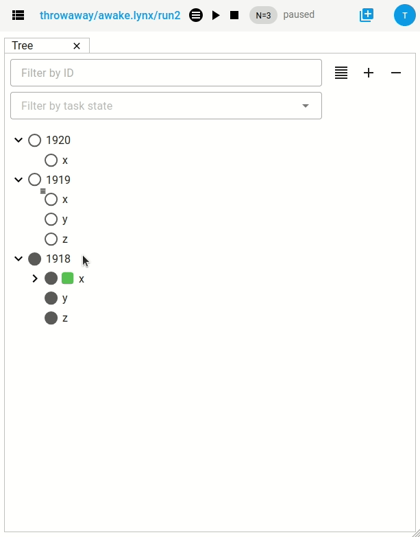
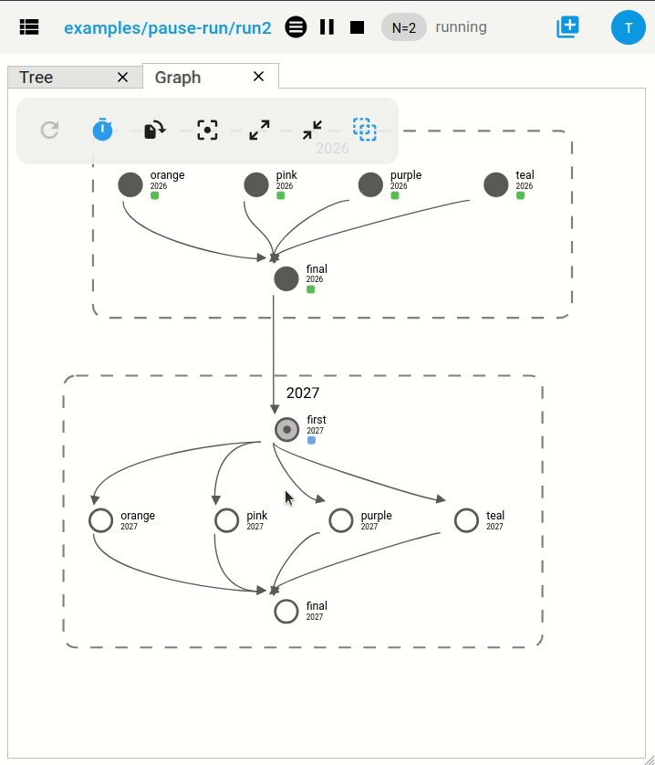
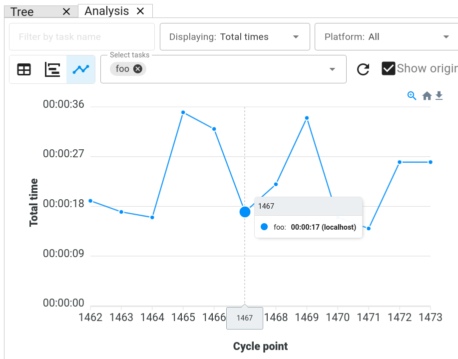

Changes
=======

This page contains a summary of significant changes across all Cylc components for each
release.

Cylc 8.6
--------

.. admonition:: Cylc Components
   :class: hint

   :cylc-flow: `8.6 <https://github.com/cylc/cylc-flow/blob/8.6.x/CHANGES.md>`__
   :cylc-ui: `2.11 <https://github.com/cylc/cylc-ui/blob/master/CHANGES.md#cylc-ui-2110-released-2025-11-27>`__
   :cylc-uiserver: `1.8 <https://github.com/cylc/cylc-uiserver/blob/1.8.x/CHANGES.md>`__
   :cylc-rose: `1.7 <https://github.com/cylc/cylc-rose/blob/1.7.x/CHANGES.md>`__
   :rose: `2.6 <https://github.com/metomi/rose/blob/2.6.x/CHANGES.md>`__

UI sidebar improvements
^^^^^^^^^^^^^^^^^^^^^^^

.. versionadded:: cylc-uiserver 1.8.1

The display of task states in the sidebar has been decluttered and numbers
have been added to indicate how many tasks are in each state. The tooltips now
have a short delay to avoid many popping up while moving the mouse around.

.. image:: ../img/cylc-ui-dash.png
   :width: 90%
   :align: center

|

.. versionadded:: cylc-uiserver 1.8.2, cylc-flow=8.6.2

Additionally, for workflows running with Cylc 8.6.2 or later, there is now a
top level icon which indicates whether there are any held or retrying tasks in
the :term:`active window`.

.. image:: ../reference/changes/workflows-view-held-and-retry-indicators.png
   :width: 45%
   :align: center

|

UI Searching & Filtering
^^^^^^^^^^^^^^^^^^^^^^^^

.. versionadded:: cylc-uiserver 1.8.2

The task filtering controls in the "Tree" and "Table" views have been overhauled.

Task name searching now supports globs, e.g ``foo*`` matches all tasks
beginning with ``foo`` and ``*foo`` matches all tasks ending in ``foo``.

.. image:: ../reference/changes/task-id-glob-filtering.png
   :width: 55%
   :align: center

|

It is now possible to filter by
:ref:`task modifiers <user_guide.task_modifiers>` as well as
:ref:`task states <task-job-states>`. So, for example, we can now filter for
tasks which are :term:`held <held task>` or awaiting :term:`retry`.

.. image:: ../reference/changes/task-modifier-filtering.png
   :width: 55%
   :align: center

|

Task Matching
^^^^^^^^^^^^^

Various Cylc commands (e.g. ``cylc trigger``, ``cylc set`` and ``cylc hold``)
allow us to select the tasks we want to operate on using cycle points,
family names or globs, e.g:

.. code-block:: bash

   # trigger active tasks in cycle "2000"
   cylc trigger workflow//2000

   # trigger active tasks in "FAMILY" in cycle "2000"
   cylc trigger workflow//2000/FAMILY

   # trigger all tasks in cycle "2000" with names starting with "foo"
   cylc trigger workflow//2000/foo*

However, prior to 8.6 family names and globs would only match :term:`active tasks <active task>`.
So, if you attempted to hold a family of tasks, Cylc would only hold the
members of the family which were active at the time.

As of Cylc 8.6.0, this restriction has been lifted, so for example, holding a
family will now hold all tasks within the family, irrespective of whether they
are active or not.

.. code-block:: bash

   # hold all tasks in "FAMILY" at cycle "2000"
   cylc hold workflow//2000/FAMILY

   # re-run all tasks in cycle "2000" (in order)
   cylc trigger workflow//2000

   # mark all tasks beginning with "foo" in cycle "2000" as "succeeded"
   cylc set workflow//2000/foo* --out=succeeded

Because Cylc workflows can be infinite, if a cycle includes a "glob" pattern
(e.g. ``*``), this will only match :term:`active cycles <active cycle>`
(any cycle which contains at least one :term:`active task`), e.g:

.. code-block:: bash

   # remove the task "foo" from all active cycles of the workflow
   cylc remove workflow//*/foo

   # release all tasks in "FAMILY" in all active cycles of the workflow
   cylc release workflow//*/FAMILY

This (combined with :ref:`changes.8.5.0.triggering_multiple_tasks`)
makes Cylc 7 "reset to waiting" use cases much easier:

.. list-table::
   :class: grid-table

   * - **Cylc 7**
     - **Cylc 8**
   * - ::

          cylc insert workflow FAMILY.cycle
          cylc reset workflow FAMILY.cycle --state=waiting
          # Trigger the task(s) that start the FAMILY sub-graph
          cylc trigger workflow member1.cycle
     - ::

          cylc trigger workflow//cycle/FAMILY

For more information on Cylc IDs, run ``cylc help id``.

Selecting tasks at initial and final cycle point
^^^^^^^^^^^^^^^^^^^^^^^^^^^^^^^^^^^^^^^^^^^^^^^^^

The initial and final cycle points in a workflow can now be referenced in
commands using the ``^`` and ``$`` symbols, e.g:

.. code-block:: console

   # trigger "mytask" at the initial cycle point
   cylc trigger myworkflow//^/mytask

   # set required outputs for "mytask" at the final cycle point
   cylc set myworkflow//$/mytask

   # remove all tasks at the final cycle point
   cylc remove myworkflow//$

Supported Python versions
^^^^^^^^^^^^^^^^^^^^^^^^^

The minimum supported Python version is now 3.12.

Automatic Broadcast Expiry
^^^^^^^^^^^^^^^^^^^^^^^^^^

Broadcasts automatically expire (i.e, are deleted) once they are no longer
required by upcoming tasks.

This means that if you try to re-run a task from the previous cycle, its
broadcasts will likely have been expired. In Cylc 8.6.0, we have pushed back
the broadcast expiry limit to make it easier to re-run tasks from the previous
cycle. For more information, see
:ref:`the user guide <user_guide.broadcast.expiry>`.

Another consequence of broadcast expiry is that broadcasts made to historical
cycles (behind the broadcast expiry point) will expire instantly.
The ``cylc trigger --on-resume`` option was added to allow us to broadcast to
a cycle before triggering the task:

* Pause the workflow.
* Trigger the task using the ``--on-resume`` option
  (the task will not run until the workflow is resumed).
* Issue the broadcast.
* Resume the workflow (the task will now run).

At Cylc 8.6.0, automatic broadcast expiry is suspended while the workflow is
paused which simplifies this process:

* Pause the workflow.
* Issue the broadcast.
* Trigger the task (no special option required).
* Resume the workflow.

Note the order of the broadcast and trigger operations has swapped to the
logical order.

The ``--on-resume`` option has been removed.

UI Command Editor
^^^^^^^^^^^^^^^^^

.. versionadded:: cylc-uiserver 1.8.2

The "command editor" allows us to edit the options for a command before we
issue it, it is opened from the context menu by pressing the pencil icon.

There is now an option to open the editor in a new tab so we can continue to
use the UI while preparing a command to submit.

.. list-table::
   :class: grid-table

   -
     * .. image:: ../reference/changes/command-editor-open-in-new-tab.png
          :width: 100%
     * .. image:: ../reference/changes/command-editor-opened-in-tab.png
          :width: 100%

----------

Cylc 8.5
--------

.. admonition:: Cylc Components
   :class: hint

   :cylc-flow: `8.5 <https://github.com/cylc/cylc-flow/blob/master/CHANGES.md>`__
   :cylc-ui: `2.8 <https://github.com/cylc/cylc-ui/blob/master/CHANGES.md>`__
   :cylc-uiserver: `1.7 <https://github.com/cylc/cylc-uiserver/blob/master/CHANGES.md>`__
   :cylc-rose: `1.6 <https://github.com/cylc/cylc-rose/blob/master/CHANGES.md>`__
   :rose: `2.5 <https://github.com/metomi/rose/blob/master/CHANGES.md>`__

More task information in the GUI (and Tui)
^^^^^^^^^^^^^^^^^^^^^^^^^^^^^^^^^^^^^^^^^^

Task now icons in the GUI and TUI have badges for tasks waiting for:

* retries |task-retry|
* xtriggers |task-xtriggered|
* wallclock |task-wallclock|

Xtriggers, wallclock triggers, retry triggers and task run mode are now
shown in the information view:

|

.. _changes.8.5.0.triggering_multiple_tasks:

Triggering Multiple Tasks
^^^^^^^^^^^^^^^^^^^^^^^^^

Cylc now respects the dependencies between tasks when triggering multiple
tasks at the same time. This provides an easy way to re-run a group of tasks
in order:

|

This is generally easier than :ref:`using a new flow <interventions.reflow>`.

Technical details:

* Prerequisites on any tasks that are outside of the group of tasks being
  triggered are automatically satisfied.
* Any tasks which have already run within the group will be automatically
  removed (i.e. ``cylc remove``) to allow them to be re-run without
  intervention.
* Any preparing, submitted or running tasks within the group will also be
  removed if necessary to allow the tasks to re-run in order.

.. _changes.warning_triangles:

Warning Triangles
^^^^^^^^^^^^^^^^^

The GUI now has warning triangles, these "light up" whenever warnings occur in
the workflow.

* Cylc logs warnings for various things such as task failures, stalled
  workflows, and command errors. You can see these in the workflow log files.
* When warnings occur, the warning triangle will illuminate for the
  corresponding workflow.
* Hover over the icon to reveal the warning.
* Click on the icon to dismiss the warning.
* If workflows are installed hierarchically, (e.g. the "development" and
  "live" groups in this example), warnings will trickle up the hierarchy
  to make it easier to monitor groups of workflows.
* A log of all warnings can be found on the Dashboard page (last 10 warnings
  for each workflow).

.. image:: ../reference/changes/warning-triangles.gif
   :align: center
   :width: 95%

|

"Ghost" Tasks
^^^^^^^^^^^^^

The GUI and Tui now present some tasks in grey:

|

These are "ghost" tasks, they indicate something is that isn't presently there:

* Waiting tasks that the scheduler hasn't moved onto yet (i.e.
  :term:`inactive tasks <active task>` that are waiting).
* Tasks which have been removed (i.e. ``cylc remove``).
* Tasks which have been triggered in the ``none`` flow, so don't influence
  the evolution of the workflow.

They appear in grey, if you click on these tasks, you will see the text
"Flows: None".

This helps to identify waiting :term:`active tasks <active task>`
(which aren't ghosts).
These are the tasks which Cylc is currently trying to schedule, but are waiting
for something, typically:

* A task prerequisite to be satisfied.
* An xtrigger or ext-trigger to be satisfied.
* Someone to :term:`resume <held task>` them.

Compatibility Mode
^^^^^^^^^^^^^^^^^^

:ref:`Cylc 7 compatibility mode <cylc_7_compat_mode>` has been deprecated, it
will be removed in Cylc 8.7.0 which is expected to be released some time in the
first half of 2026.

Any workflows that are still using ``suite.rc`` files will need to be upgraded
to ``flow.cylc`` before they are able to run with 8.7.0.

GUI Layout
^^^^^^^^^^

The Cylc GUI now preserves tab layout between sessions.

When working on a workflow, we can open multiple tabs (tree, table, graph, etc)
and tile them up in a layout. If you switch to another workflow, switch back,
your layout will be restored.

However, with Cylc 8.4, if you refreshed the browser or opened the GUI in a new
tab, the layout would be lost.

With Cylc 8.5, the layout will always be restored.

GUI Log View
^^^^^^^^^^^^^

The GUI now picks the default job log file to display based on the task state:

* failed -> ``job.err``
* submit-failed -> ``job-activity.log``
* otherwise -> ``job.out``

This speeds up the loading of the log file because the GUI doesn't have to
wait for a listing of available log files before picking one to view.

Additionally, the log view now has an auto scroll feature which follows the
end of the file (useful for viewing the file whilst it is being written), and
a scroll-to-top button.

Cylc Tui
^^^^^^^^

``cylc tui`` can now open log files in external tools.

.. image:: ../reference/changes/tui-external-editor.gif
   :align: center
   :width: 65%

|

Configure your ``$EDITOR``, ``$GEDITOR`` and ``$PAGER`` environment variables
to change which tool is used.

.. note::

   Make sure your configured command waits for the tool to be closed before
   exiting, e.g. use ``GEDITOR=gvim -f`` rather than ``EDITOR=gvim``.

Additionally, Tui now displays task states and :term:`flow` numbers in
context menus for improved clarity / accessibility.

Cylc Reload
^^^^^^^^^^^

``cylc reload`` now has a ``--global`` option to reload the global
configuration while the server is running. This can be used to update platform
settings for an in-progress workflow.

.. seealso::

    :ref:`global-configuration`

Cylc Set
^^^^^^^^

The ``cylc set`` command can now be used to satisfy xtrigger prerequisites.
For example if the task ``2026/get_data`` is
:term:`clock triggered <clock trigger>`, you might satisfy this prerequisite
like so:

.. code-block:: console

   $ cylc set myworkflow//2026/get_data --pre xtrigger/wall_clock

The default behaviour of the ``cylc set`` command has also changed for tasks
where success is :term:`optional <optional output>`, it will now set the
``succeeded`` output (and any other outputs that are required in the event of
task success) which is more consistent with the behaviour for tasks where
success is required.

Cycle Share Directory
^^^^^^^^^^^^^^^^^^^^^

A new per-cycle share directory has been added, ``share/cycle/<cycle>``.

This directory is now automatically created and provides a convenient location
for tasks to share cycle-specific data. See also :ref:`Shared Task IO Paths`.

This largely replicates the functionality of the Rose :envvar:`ROSE_DATAC`
environment variable, but does not require the use of ``rose task-env``.

Cylc UI Server
^^^^^^^^^^^^^^

The dependency stack of the Cylc UI Server (used to serve the Cylc GUI) has
been overhauled.

This allows the UI Server to be installed with newer versions of Python then
the old dependency stack allowed.

* Previously the UI Server worked with Python 3.8-3.9.
* It now works with Python 3.9 or higher.

This will likely bring efficiency improvements.

Additionally, the Cylc UI Server has now been configured to send "heartbeat"
pings down its open websocket connections. This helps to prevent web proxies
from closing Cylc GUI connections when workflows are idle, preventing erroneous
GUI disconnects.

For more information see the
`Cylc configuration <https://github.com/cylc/cylc-uiserver/blob/3ab99ecec09077132fa912d0752a06b14764f05d/cylc/uiserver/jupyter_config.py#L63-L66>`_
and the docs for the ``websocket_ping_interval`` and ``websocket_ping_timeout``
configurations in
`tornado <https://www.tornadoweb.org/en/stable/web.html#tornado.web.Application.settings>`_.

----------

Cylc 8.4
--------

.. admonition:: Cylc Components
   :class: hint

   :cylc-flow: `8.4 <https://github.com/cylc/cylc-flow/blob/master/CHANGES.md>`__
   :cylc-ui: `2.7 <https://github.com/cylc/cylc-ui/blob/master/CHANGES.md>`__
   :cylc-uiserver: `1.6 <https://github.com/cylc/cylc-uiserver/blob/master/CHANGES.md>`__
   :cylc-rose: `1.5 <https://github.com/cylc/cylc-rose/blob/master/CHANGES.md>`__
   :rose: `2.4 <https://github.com/metomi/rose/blob/master/CHANGES.md>`__

Wrapper script fix for Cylc Hub
^^^^^^^^^^^^^^^^^^^^^^^^^^^^^^^

.. versionadded:: cylc-flow 8.4.1

Fixed wrapper script ``$PATH`` override preventing selection of Cylc version
when playing workflows in the GUI on :ref:`Cylc Hub`.

.. important::

   Sites with existing wrapper scripts should update them with this change:
   https://github.com/cylc/cylc-flow/pull/6616/files.

.. seealso::

   :ref:`managing environments`

Cylc Remove
^^^^^^^^^^^

``cylc remove`` now allows removing tasks which are no longer active, making
it look like they never ran. Removing a running task will now kill that task.

The ``cylc remove`` command now has the ``--flow`` option, allowing removal
of a task from specific flows.

Tasks removed from all flows are retained in the workflow database with
``flow=none`` for provenance.

.. image:: ../user-guide/interventions/remove.gif
   :width: 60%

.. seealso::

   See :ref:`interventions.remove_tasks` to see an example of this feature in
   action.

Skip Mode
^^^^^^^^^

Tasks can now be run in "skip" mode where they complete
their required outputs instantly.
Tasks can be configured to run in skip mode either in the workflow configuration
or by broadcasting.

``cylc set --out skip`` will set outputs for a task as if the task has run
in skip mode. The task outputs delivered by skip mode can be customized using
:cylc:conf:`[runtime][<namespace>][skip]outputs` or defaults to behaviour
described in :ref:`skip_mode.task_outputs`.

This can be used to skip a cycle or a task (for a full example see :ref:`interventions.skip_cycle`).

It may also be useful for :ref:`EfficientInterFamilyTriggering` and
for :ref:`skip_mode.parameter_exclusion`.

.. seealso::

   :ref:`task-run-modes.skip`

Trigger When Paused
^^^^^^^^^^^^^^^^^^^

Tasks can now be triggered and will run immediately while the workflow
is paused.

.. seealso::

   :ref:`interventions.trigger_while_paused` for an example of this feature.

EmPy Support Removed
^^^^^^^^^^^^^^^^^^^^

Support for the EmPy template processor (an alternative to Jinja2) has been
removed.

Info View
^^^^^^^^^

An info view has been added, displaying

* :cylc:conf:`[runtime][<namespace>][meta]`.
* :ref:`task ouputs<required outputs>`.
* Task :term:`prerequisite`.
* Task :term:`output completion condition`.

.. image:: changes/cylc-gui-info-view.gif
   :width: 80%

----------

Cylc 8.3
--------

.. admonition:: Cylc Components
   :class: hint

   :cylc-flow: `8.3 <https://github.com/cylc/cylc-flow/blob/master/CHANGES.md>`__
   :cylc-ui: `2.5 <https://github.com/cylc/cylc-ui/blob/master/CHANGES.md>`__
   :cylc-uiserver: `1.5 <https://github.com/cylc/cylc-uiserver/blob/master/CHANGES.md>`__
   :cylc-rose: `1.4 <https://github.com/cylc/cylc-rose/blob/master/CHANGES.md>`__
   :rose: `2.3 <https://github.com/metomi/rose/blob/master/CHANGES.md>`__

Manually setting task outputs and prerequisites
^^^^^^^^^^^^^^^^^^^^^^^^^^^^^^^^^^^^^^^^^^^^^^^

At Cylc 8.3.0, the ``cylc set-outputs`` command has been replaced by the new
``cylc set`` command.

The ``cylc set-outputs`` command made it look like an output had been generated
to downstream tasks, but did not update the task status to match. As a result,
it was often necessary to use ``cylc remove`` in combination with ``cylc
set-outputs``.

The new ``cylc set`` command is able to directly set task outputs as if they
had completed naturally, making the command more intuitive and avoiding the
need for ``cylc remove``. It can also set prerequisites, as if they were satisfied naturally.

For example, say there's a failed task holding up your workflow and you want
Cylc to continue as if the task had succeeded. Here are the interventions
you would need to perform with Cylc 8.2 and 8.3 side-by-side.

.. list-table::
   :class: grid-table
   :widths: 50 50

   * - **Cylc 8.2** (set-outputs)
     - **Cylc 8.3** (set)
   * - .. code-block:: bash

          # let downstream tasks run:
          cylc set-outputs <task>
          # remove the failed task:
          cylc remove <task>

     - .. code-block:: bash

          # tell Cylc that the task succeeded:
          cylc set <task>

   * - .. image:: changes/cylc-set-outputs.gif
          :align: center
          :width: 100%

     - .. image:: changes/cylc-set.gif
          :align: center
          :width: 100%

Tui
^^^

The Tui (terminal user interface) is a command line version of the Gui.
You can use it to monitor and control your workflows.

There has been a major update to Tui at Cylc 8.3.0:

* Larger workflows will no longer cause Tui to time out.
* You can now browse all your workflows including stopped workflows.
* You can monitor multiple workflows at the same time.
* The workflow and job logs are now available from within Tui.

.. image:: changes/tui-1.gif
   :width: 100%

N-Window selector in the GUI
^^^^^^^^^^^^^^^^^^^^^^^^^^^^

The :term:`n-window` determines how much of a workflow is visible in the GUI / Tui.

You can change the n-window extent in the GUI with a toolbar button, to display
more or less of the graph around current :term:`active tasks <active task>`.
This affects all GUI views equally, not just the graph view.

The ``n=0`` window contains only the active tasks.

The ``n=1`` window displays tasks out to one graph edge around the active
tasks; ``n=2`` out to two graph edges; and so on.

.. note::

   This is currently a per-workflow setting so changing the n-window in one
   browser tab will also change it in other browser tabs and Tui sessions.

.. warning::

   Using high n-window values with complex workflows may have performance
   impacts.

Group by cycle point in the graph view
^^^^^^^^^^^^^^^^^^^^^^^^^^^^^^^^^^^^^^

The graph view now has an option to group tasks by cycle point.

.. image:: changes/cylc-graph-group-by-cycle-point.png
   :width: 100%

Gantt View
^^^^^^^^^^

The GUI now has a `Gantt <https://en.wikipedia.org/wiki/Gantt_chart>`_ view option:

Analysis View
^^^^^^^^^^^^^

New Analysis added - a layout which plots run times against cycle points.

Completion Expressions
^^^^^^^^^^^^^^^^^^^^^^

When a task achieves a final status, its outputs are validated against a "completion
expression" to ensure that it has produced all of its
:term:`required outputs <required output>`.
If a task fails this validation check it is said to have "incomplete outputs"
and will be retained in the :term:`n=0 window <n-window>` pending user intervention.

This completion expression is generated automatically from the graph.
By default, tasks are expected to succeed, if you register any additional
required output in the graph, then these must also
be produced.

At Cylc 8.3.0 it is now possible to manually configure this completion
expression for finer control. This is particularly useful for anyone using
:term:`custom outputs <custom output>`.

For example, ``mytask`` must produce one of the outputs ``x`` or ``y`` to pass
the completion expression configured here:

.. code-block:: cylc

   [runtime]
       [[mytask]]
           completion = succeeded and (x or y)
           [[[outputs]]]
               x = output-x
               y = output-y

For more information, see the reference for the
:cylc:conf:`[runtime][<namespace>]completion` configuration.

Workflow State Triggers & Commands
^^^^^^^^^^^^^^^^^^^^^^^^^^^^^^^^^^

Workflow state xtriggers and command now take Cylc universal IDs instead of
separate arguments:

For example, you can (and should) now write:

.. code-block:: diff

   # On the command line
   - cylc workflow-state my-workflow --point 20240101 --task mytask --message "succeeded"
   + cylc workflow-state my-workflow//20240101/mytask:succeeded --triggers

   # In the flow.cylc file
   - my_xtrigger = workflow_state(
   -     workflow="my-workflow",
   -     task="mytask",
   -     point="20240101",
   -     message="succeeded"
   - )
   + my_xtrigger = workflow_state('my-workflow//20240101/mytask:succeeded', is_trigger=True)

.. important::

   The new workflow state trigger syntax can use either the trigger or message from
   ``trigger=message`` in :cylc:conf:`[runtime][<namespace>][outputs]`.

   The trigger and message are the same for the most common use cases (``succeeded`` and ``started``)
   but may differ for other outputs, namely :term:`custom outputs <custom output>`.

.. note::

   The ``suite-state`` xtrigger has been reimplemented for compatibility with
   Cylc 7 workflows.

----------

Cylc 8.2
--------

.. admonition:: Cylc Components
   :class: hint

   :cylc-flow: `8.2 <https://github.com/cylc/cylc-flow/blob/8.2.7/CHANGES.md>`__
   :cylc-uiserver: `1.4 <https://github.com/cylc/cylc-uiserver/blob/1.4.4/CHANGES.md>`__
   :cylc-rose: `1.3 <https://github.com/cylc/cylc-rose/blob/1.3.4/CHANGES.md>`__

UI now remembers workspace tab layout
^^^^^^^^^^^^^^^^^^^^^^^^^^^^^^^^^^^^^

.. versionadded:: cylc-uiserver 1.4.4

The UI now remembers the layout of your workspace tabs when you navigate away
from that workflow. Note that this only applies per browser session.

.. image:: changes/ui-workspace-tabs.gif
   :width: 100%

Cylc ignores ``$PYTHONPATH``
^^^^^^^^^^^^^^^^^^^^^^^^^^^^

Cylc now ignores ``$PYTHONPATH`` to make it more robust to task
environments which set this value. If you want to add to the Cylc
environment itself, e.g. to install a Cylc extension,
use a custom xtrigger, or event handler use ``$CYLC_PYTHONPATH``.

Upgrade To The Latest Jupyter Releases
^^^^^^^^^^^^^^^^^^^^^^^^^^^^^^^^^^^^^^

.. versionadded:: cylc-uiserver 1.4.0

The Cylc UI Server has been updated to work with the latest releases of
`Jupyter Server`_ and `Jupyter Hub`_.

If you are utilising Cylc's multi-user functionality then your configuration
will require some changes to work with these releases.

See :ref:`cylc.uiserver.multi-user` for more details

.. versionadded:: cylc-uiserver 1.3.0

You can now configure the view which is opened by default when you navigate to
a new workflow in the GUI. Navigate to the settings page to select your chosen
view.

In the future we plan to support configuring a layout of multiple views and
configuring certain options on those views.

Reload
^^^^^^

.. versionadded:: cylc-flow 8.2.0

When workflows are
:ref:`reloaded <Reloading The Workflow Configuration At Runtime>`,
(e.g. by ``cylc reload``), Cylc will now pause the workflow and wait for any
preparing tasks to be submitted before proceeding with the reload.
Once the reload has been completed, the workflow will be resumed.

You can now see more information about the status of the reload in the
workflow status message which appears at the top of the GUI and Tui interfaces.

----------

Cylc 8.1
--------

.. admonition:: Cylc Components
   :class: hint

   :cylc-flow: `8.1 <https://github.com/cylc/cylc-flow/blob/8.1.4/CHANGES.md>`__
   :cylc-uiserver: `1.2 <https://github.com/cylc/cylc-uiserver/blob/1.2.2/CHANGES.md>`__
   :cylc-rose: `1.1 <https://github.com/cylc/cylc-rose/blob/1.1.1/CHANGES.md>`__

.. warning::

   Workflows started with Cylc 8.0 which contain multiple :term:`flows <flow>`
   **cannot** be restarted with Cylc 8.1 due to database changes.

Analysis View
^^^^^^^^^^^^^

.. versionadded:: cylc-uiserver 1.2.2

The web UI also has a new view for displaying task queue & run time statistics.

.. image:: changes/analysis_view.gif
   :width: 80%

Graph View
^^^^^^^^^^

.. versionadded:: cylc-uiserver 1.2.0

The web UI now has a graph view which displays a visualisation of a workflow's graph:

.. image:: changes/cylc-graph.gif
   :width: 80%

Family & cycle grouping as well as the ability to view graphs for stopped workflows
will be added in later releases.

Log View
^^^^^^^^

.. versionadded:: cylc-uiserver 1.2.0

The web UI now has a log view which displays workflow and job log files:

.. image:: changes/log-view-screenshot.png
   :width: 80%

Support for viewing more log files, syntax highlighting, searching and line
numbers are planned for future releases.

Edit Runtime
^^^^^^^^^^^^

.. versionadded:: cylc-uiserver 1.2.0

The web UI now has a command for editing the :cylc:conf:`[runtime]` section
of a task or family.

.. image:: changes/edit-runtime-screenshot.png
   :width: 80%

Any changes made are :ref:`broadcast <cylc-broadcast>` to the running workflow.

Combined Commands
^^^^^^^^^^^^^^^^^

.. versionadded:: cylc-flow 8.1.0

Two new commands have been added as short-cuts for common working patterns:

``cylc vip``
   Validate, install and plays a workflow, equivalent to:

   .. code-block:: bash

      cylc validate <path>
      cylc install <path>
      cylc play <id>

``cylc vr``
   Validate and reinstall a workflow, then either:
   - reload the workflow if it is running.
   - restart the workflow if it is stopped.

.. image:: changes/vip-vr.gif
   :width: 100%

For more information see the command line help:

.. code-block:: bash

   cylc vip --help
   cylc vr --help

Bash Completion
^^^^^^^^^^^^^^^

.. versionadded:: cylc-flow 8.1.0

Cylc now provides a high performance Bash completion script which saves you typing:

* Cylc commands & options
* Workflow IDs
* Cycle points
* Task names
* Job numbers

.. image:: changes/cylc-completion.bash.gif
   :width: 80%

:ref:`Installation instructions <installation.shell_auto_completion>`.

----------

Cylc 8.0
--------

.. admonition:: Cylc Components
   :class: hint

   :cylc-flow: `8.0 <https://github.com/cylc/cylc-flow/blob/8.0.0/CHANGES.md#user-content-major-changes-in-cylc-8>`__
   :cylc-uiserver: `1.1 <https://github.com/cylc/cylc-uiserver/blob/1.1.0/CHANGES.md#user-content-cylc-uiserver-110-released-2022-07-28>`__
   :cylc-rose: `1.1 <https://github.com/cylc/cylc-rose/blob/1.1.0/CHANGES.md#user-content-cylc-rose-110-released-2022-07-28>`__

The first official release of Cylc 8.

For a summary of changes see the :ref:`migration guide<728.overview>`.
