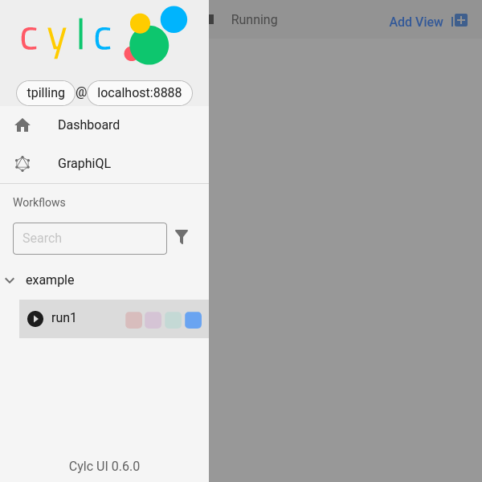

.. _tutorial-cylc-runtime-introduction:

Introduction
============

.. ifnotslides::

   So far we have worked with the ``[scheduling]`` section of the ``flow.cylc``
   file, where workflow :term:`tasks <task>` and :term:`dependencies
   <dependency>` are defined.

   Now, in the ``[runtime]`` section, we need to associate each task with a
   script or application to run when its dependencies are met.

.. ifslides::

   ``[scheduling]``
      Defines the workflow in terms of :term:`tasks <task>` and
      :term:`dependencies <dependency>`.
   ``[runtime]``
      Determines what runs, where, and how it runs, for each task.

Task Definitions
----------------

.. ifnotslides::

   The runtime settings for each task are stored in a sub-section of the
   ``[runtime]`` section. E.g. for a task called ``hello_world`` we would write
   settings inside the following section:

.. code-block:: cylc

   [runtime]
       [[hello_world]]

.. note::

   A runtime sub-section for each task is normally required, even if it is
   empty. However, in the previous tutorials we disabled this requirement
   with :cylc:conf:`flow.cylc[scheduler]allow implicit tasks`.
   See :ref:`ImplicitTasks` for more details.

The ``script`` Setting
----------------------

.. ifnotslides::

   The task ``script`` setting tells Cylc *what* to execute when a task is
   ready to run.

   This value of this setting is interpreted as a bash script. The following
   example defines a task called ``hello_world`` which simply writes ``Hello
   World!`` to standard output.

.. code-block:: cylc

   [runtime]
       [[hello_world]]
           script = echo 'Hello World!'

.. note::

   A task with no ``script`` defined will run a job that does nothing but
   communicate its status back to the scheduler before exiting immediately.

We can also call other scripts or executables in this way, e.g:

.. code-block:: cylc

   [runtime]
       [[hello_world]]
           script = ~/foo/bar/baz/hello_world

``PATH`` and :envvar:`PYTHONPATH`
---------------------------------

.. ifnotslides::

   Keeping task scripts with the workflow, rather than leaving them elsewhere on
   the system, helps isolate the workflow from external changes.

   To help with this, Cylc automatically adds a ``bin/`` sub-directory of the
   workflow :term:`source directory` to the executable search path (``$PATH``)
   in task job environments.

.. code-block:: bash
   :caption: bin/hello_world

   #!/bin/bash
   echo 'Hello World!'

.. code-block:: cylc
   :caption: flow.cylc

   [runtime]
       [[hello_world]]
           script = hello_world

.. nextslide::

.. ifnotslides::

   Similarly the ``lib/python/`` directory gets prepended to the
   :envvar:`PYTHONPATH` variable.

.. code-block:: python
   :caption: lib/python/hello.py

   def world():
      print('Hello World!')

.. code-block:: cylc
   :caption: flow.cylc

   [runtime]
      [[hello_world]]
         script = python -c 'import hello; hello.world()'

.. _tutorial-tasks-and-jobs:

Tasks And Jobs
--------------

.. ifnotslides::

   When a :term:`task` is ready to run Cylc creates a :term:`job script` for
   it: a bash file containing the scripting defined for the task along with
   other configuration and error trapping code. This is what actually executes
   as the task job.

   :term:`Tasks<task>` typically go through the following states as a workflow
   runs:

   Waiting
      Waiting for dependencies to be met.
   Preparing
      Dependencies met; preparing the task :term:`job script` for submission.
   Submitted
      Task job script submitted to the :term:`job runner`; waiting on execution.
   Running
      Task job script executing.
   Succeeded
      Task job completed successfully (i.e. exited with 0 return status).

   There are several other task states as well, such as **failed**.

   See the :ref:`next section for more about running jobs <tutorial-job-runner>`.

.. ifslides::

   When a :term:`task` is ready to run, Cylc creates a :term:`job`.

   The life-cycle of a task:

   * Waiting
   * Preparing
   * Submitted
   * Running
   * Succeeded / Failed

The Cylc User Interfaces
------------------------

.. ifnotslides::

   To help you to keep monitor and control running workflows Cylc has

   - A graphical user interface (Cylc GUI).
   - A terminal-based user interface (Cylc TUI).
   - A comprehensive command line interface (Cylc CLI).

.. _tutorial.cli:

The Cylc CLI
^^^^^^^^^^^^

.. ifnotslides::

   You can start, stop, query, and control workflow, in every possible way,
   from the command line.

   All Cylc commands have built-in help information:

.. code-block:: bash

   cylc help
   cylc play --help  # etc.

.. _tutorial.tui:

The Cylc TUI
^^^^^^^^^^^^

.. ifnotslides::

   The Cylc TUI (Terminal User Interface) enables you to view and interact
   with your workflows.

   To start the Cylc TUI:

.. code-block:: bash

   cylc tui <workflow_id>

.. _tutorial.gui:

The Cylc GUI
^^^^^^^^^^^^

.. ifnotslides::

   The Cylc GUI has different views you can use to examine your workflows,
   including a Cylc scan menu allowing you to switch between workflows.

   .. note::

      You only need to have one instance of the Cylc GUI open - you can
      easily switch between workflows.

   To start the Cylc UI, open a new terminal window or tab, then type:

.. code-block:: bash

   cylc gui

.. nextslide::

Task & Job States
^^^^^^^^^^^^^^^^^

.. ifnotslides::

   - Task states have grey icons.
   - Job states have colour coded squares.

.. csv-table::
   :header: Task Icon, Job Icon, Description
   :align: left
   :widths: 25, 25, 50

   |task-waiting|, , Task waiting
   |task-submitted|, |job-submitted|, Job submitted
   |task-running|, |job-running|, Job running
   |task-succeeded|, |job-succeeded|, Job ran successfully
   |task-failed|, |job-failed|, Job failed

.. ifnotslides::

   .. seealso::

      Full list of :ref:`task-job-states`.

.. nextslide::

.. ifnotslides::

   This is the "tree" view:

.. figure:: ../img/cylc-gui-tree-view.png
   :figwidth: 75%
   :align: center

   Screenshot of the Cylc GUI in "Tree" view mode.

.. nextslide::

This is the "table" view:

.. figure:: ../img/cylc-gui-table-view.png
   :figwidth: 75%
   :align: center

   Screenshot of the Cylc GUI in "Table" view mode.

.. nextslide::

.. ifnotslides::

   You can navigate between workflows using the list on the left (the
   screenshot shows only one, however).

   Screenshot of the Cylc GUI "Scan" bar.

Validating A Workflow
---------------------

.. ifnotslides::

   We recommend using ``cylc validate`` to check a workflow definition for
   errors before running it.

.. code-block:: console

   $ cylc validate ~/cylc-src/my_workflow

Installing A Workflow
---------------------

.. ifnotslides::

   .. seealso::

      :ref:`The full guide to Cylc install <Installing-workflows>`.

   To separate the development and running of workflows, use the
   :term:`cylc install <install>` command.

.. code-block:: bash

   cylc install my_workflow

.. ifnotslides::

   This will install ``~/cylc-src/my_workflow`` to ``~/cylc-run/my_workflow/runN``.

Running a workflow
------------------

.. ifnotslides::

   Now we have installed the workflow we can run it
   using the ``cylc play`` command:

.. code-block:: console

   $ cylc play my_workflow

.. ifnotslides::

Generated Workflow Files
------------------------

Numbered run directories
^^^^^^^^^^^^^^^^^^^^^^^^

.. ifnotslides::

   .. seealso::

      :ref:`Installing-workflows` for a fuller description of Cylc install,
      including the option of naming rather than numbering runs.

   By default ``cylc install`` will create a new numbered run directory each
   time you run it:

.. code-block:: console

   $ cylc install my_workflow
   INSTALLED my_workflow/run1 from ...
   $ cylc install my_workflow
   INSTALLED my_workflow/run2 from ...

   # The most recent ``runX`` directory is symlinked to ``runN``
   $ ls -l ~/cylc-run/my_workflow/runN
   ~/cylc-run/baz/runN -> run2

.. nextslide::

.. ifnotslides::

   You can run cylc commands using a specific run number, but if you don't,
   ``runN`` will be used:

.. code-block:: console

   $ cylc play my_workflow
   # is the same as
   $ cylc play my_workflow/runN
   # and the same as (in this case)
   $ cylc play my_workflow/run2

Files Generated at Runtime
^^^^^^^^^^^^^^^^^^^^^^^^^^

.. ifnotslides::

   Cylc generates files and directories when it runs a workflow, namely:

   ``log``
      ``db``
         The database which Cylc uses to record the state of the workflow;
      ``job``
         The directory where all :term:`job log files <job log>` live,
         primarily the job script itself (``job``) and the job output logs
         (``job.out`` and ``job.err``);
      ``workflow``
         The directory where :term:`scheduler log files <workflow log>` live.
         These are written as the workflow runs and are useful when troubleshooting.
      ``flow-config/flow.cylc.processed``
         A copy of the :cylc:conf:`flow.cylc` file made after any `Jinja2`_ has been
         processed - we will cover this in the
         :ref:`tutorial-cylc-consolidating-configuration` section.

   ``share/``
      The :term:`share directory` is where :term:`tasks <task>` can
      read or write files shared with other tasks.
   ``work/``
      Contains task :term:`work directories <work directory>`, i.e. the
      *current working directories* of running task jobs. These are
      removed automatically if empty when a task finishes.

    The job log directory path ends in ``<cycle-point>/<task-name>/<job-submission-num>/``,
    where the :term:`job submission number` starts at 1 and increments each time a
    task re-runs.

    You can use the command line to view scheduler or task job logs without
    having to find them yourself on the filesystem:

    .. code-block:: bash

       cylc cat-log <workflow-name>
       cylc cat-log <workflow-name>//<cycle-point>/<task-name>

.. ifslides::

   * ``log/``
      * ``db``
      * ``job``
      * ``workflow``
      * ``flow-config/flow.cylc.processed``
   * ``share/``
   * ``work/``

   .. nextslide::

   .. rubric:: In this practical we will add some scripts to, and run, the
      :ref:`weather forecasting workflow <tutorial-datetime-cycling-practical>`
      from the :ref:`scheduling tutorial <tutorial-scheduling>`.

   Next section: :ref:`tutorial-cylc-runtime-configuration`

.. ifnotslides::

   .. note::
      If you used pip to install Cylc, you will need to run

      .. code-block:: bash

         pip install 'cylc-flow[tutorial]'

      to install extra dependencies needed for running the following
      tutorial workflows.

.. practical::

   .. rubric:: In this practical we will add some scripts to, and run, the
      :ref:`weather forecasting workflow <tutorial-datetime-cycling-practical>`
      from the :ref:`scheduling tutorial <tutorial-scheduling>`.

   #. **Create A New Workflow.**

      The following command will copy some workflow files into
      a new source directory called ``runtime-introduction``:

      .. code-block:: bash

         cylc get-resources tutorial
         cd ~/cylc-src/tutorial/runtime-introduction

      This includes the :cylc:conf:`flow.cylc` file from the
      :ref:`weather forecasting workflow <tutorial-datetime-cycling-practical>`
      with some runtime configuration added to it.

      There is also a script called ``get-observations`` located in the bin
      directory.

      Take a look at the ``[runtime]`` section in the :cylc:conf:`flow.cylc` file.

   #. **Run The Workflow.**

      First validate the workflow by running:

      .. code-block:: bash

         cylc validate .

      Then install the workflow:

      .. code-block:: bash

         cylc install

      Open a user interface (:ref:`tutorial.tui` or :ref:`tutorial.gui`) to view
      your workflow.

      Finally run the workflow by executing:

      .. code-block:: bash

         cylc play runtime-introduction

      The tasks will start to run - you should see them going through the
      *waiting*, *running* and *succeeded* states. The *preparing* and
      *submitted* states may be too quick to notice.

      When the workflow reaches the final cycle point and all tasks have succeeded
      the scheduler will shutdown automatically.

      .. tip::

         You can run a workflow from the Cylc GUI by pressing the "play"
         button at the top.

   #. **Inspect A Job Log.**

      Try opening the ``job.out`` log for one of the
      ``get_observations`` tasks in a text editor. The file will be
      in the :term:`job log directory`:

      .. code-block:: sub

         cd ~/cylc-run/runtime-introduction/runN
         cat log/job/<cycle-point>/get_observations_heathrow/01/job.out

      You should see something like this:

      .. code-block:: none

         Workflow    : runtime-introduction
         Task Job : 20000101T0000Z/get_observations_heathrow/01 (try 1)
         User@Host: username@hostname

         Guessing Weather Conditions
         Writing Out Wind Data

         1970-01-01T00:00:00Z NORMAL - started
         2038-01-19T03:14:08Z NORMAL - succeeded

      * The first three lines are identifying information written by Cylc.
      * *The lines in the middle are the job stdout.*
      * The last two lines are written by Cylc, to record job start and finish
        times. The started message would be above the job stdout for a
        longer-running job.

   #. **Inspect A Work Directory.**

      The ``get_rainfall`` task should create a file called ``rainfall`` in its
      :term:`work directory`. Try opening this file, recalling that the
      format of the relevant path from within the work directory will be:

      .. code-block:: sub

         work/<cycle-point>/get_rainfall/rainfall

      .. hint::

         The ``get_rainfall`` task only runs every third cycle.

   #. **Extension: Explore The Cylc GUI**

      * Try re-installing the workflow and running it from the GUI.

      * Try adding a new view(s).

        .. tip::

           You can do this from the "Add View" button (top-right):

           .. image:: ../img/cylc-gui-views-button.png
              :align: center
              :scale: 75%

      * Try pressing the "Pause" button which is found in the top left-hand
        corner of the GUI.

      * Try clicking on a task state icon. From the menu you could try:

        * "Trigger"
        * "Hold"
        * "Release"

   .. seealso::

      See guide to :ref:`task-job-states` for a guide to the icons.
