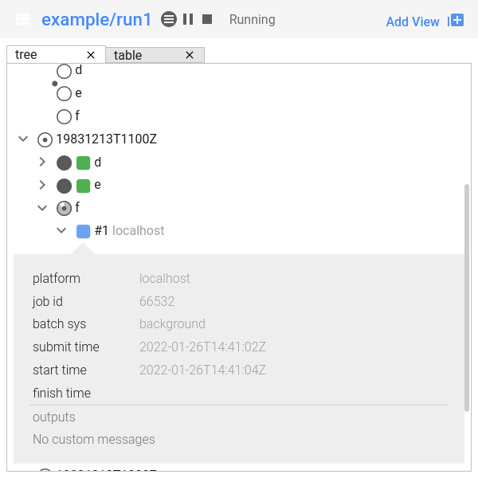
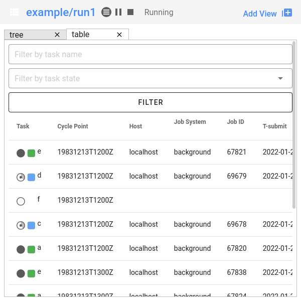

.. _tutorial-cylc-runtime-introduction:

Introduction
============

.. ifnotslides::

   So far we have been working with the ``[scheduling]`` section. This is where
   the workflow is defined in terms of :term:`tasks <task>` and
   :term:`dependencies <dependency>`.

   In order to make the workflow runnable we must associate tasks with scripts
   or binaries to be executed when the task runs. This means working with the
   ``[runtime]`` section which determines what runs, as well as where and how
   it runs.

.. ifslides::

   ``[scheduling]``
      Defines the workflow in terms of :term:`tasks <task>` and
      :term:`dependencies <dependency>`.
   ``[runtime]``
      Defines what runs, where and how it runs.

The Task Section
----------------

.. ifnotslides::

   The runtime settings for each task are stored in a sub-section of the
   ``[runtime]`` section. E.g. for a task called ``hello_world`` we would write
   settings inside the following section:

.. code-block:: cylc

   [runtime]
       [[hello_world]]

.. note::

   A runtime sub-section for each task is normally required, even if it is
   empty. However, in the previous tutorials we disabled this requirement
   with :cylc:conf:`flow.cylc[scheduler]allow implicit tasks`.
   See :ref:`ImplicitTasks` for more details.

The ``script`` Setting
----------------------

.. ifnotslides::

   We tell Cylc *what* to execute when a task is run using the ``script``
   setting.

   This setting is interpreted as a bash script. The following example defines a
   task called ``hello_world`` which writes ``Hello World!`` to stdout upon
   execution.

.. code-block:: cylc

   [runtime]
       [[hello_world]]
           script = echo 'Hello World!'

.. note::

   If you do not set the ``script`` for a task then nothing will be run.

We can also call other scripts or executables in this way, e.g:

.. code-block:: cylc

   [runtime]
       [[hello_world]]
           script = ~/foo/bar/baz/hello_world

``PATH`` and :envvar:`PYTHONPATH`
---------------------------------

.. ifnotslides::

   It is often a good idea to keep our scripts with the Cylc workflow rather than
   leaving them somewhere else on the system.

   If you create a ``bin/`` sub-directory within the :term:`source directory`,
   Cylc will automatically prepend it to the ``PATH`` environment
   variable when the task runs.

.. code-block:: bash
   :caption: bin/hello_world

   #!/bin/bash
   echo 'Hello World!'

.. code-block:: cylc
   :caption: flow.cylc

   [runtime]
       [[hello_world]]
           script = hello_world

.. nextslide::

.. ifnotslides::

   Similarly the ``lib/python/`` directory gets prepended to the
   :envvar:`PYTHONPATH` variable.

.. code-block:: python
   :caption: lib/python/hello.py

   def world():
      print('Hello World!')

.. code-block:: cylc
   :caption: flow.cylc

   [runtime]
      [[hello_world]]
         script = python -c 'import hello; hello.world()'

.. _tutorial-tasks-and-jobs:

Tasks And Jobs
--------------

.. ifnotslides::

   When a :term:`task` is "Run" it creates a :term:`job`. The job is a bash
   file containing the script you have told the task to run along with
   configuration specifications and a system for trapping errors. It is the
   :term:`job` which actually gets executed and not the task itself. This
   "job file" is called the :term:`job script`.

   During its life a typical :term:`task` goes through the following states:

   Waiting
      :term:`Tasks <task>` wait for their dependencies to be satisfied before
      running. In the meantime they are in the "Waiting" state.
   Submitted
      When a :term:`task's <task>` dependencies have been met it is ready for
      submission. During this phase the :term:`job script` is created.
      The :term:`job` is then submitted to the specified :term:`job runner`.
      There is more about this in the :ref:`next section
      <tutorial-job-runner>`.
   Running
      A :term:`task` is in the "Running" state as soon as the :term:`job` is
      executed.
   Succeeded
      If the :term:`job` submitted by a :term:`task` has successfully
      completed (i.e. there is zero return code) then it is said to have
      succeeded.

   These descriptions, and a few more (e.g. failed), are called the
   :term:`task states <task state>`.

.. ifslides::

   When a :term:`task` is "Run" it creates a :term:`job`.

   The life-cycle of a job:

   * Waiting
   * Submitted
   * Running
   * Succeeded / Failed

The Cylc User Interfaces
------------------------

.. ifnotslides::

   To help you to keep track of a running workflow Cylc has
   - A graphical user interface (Cylc GUI).
   - A text-based user interface (Cylc TUI).

.. _tutorial.tui:

The Cylc TUI
^^^^^^^^^^^^

.. ifnotslides::

   The Cylc TUI, (Text User Interface) is bundled with Cylc and
   enables you to view and interact with your workflow.

   To start the Cylc TUI:

.. code-block:: bash

   cylc tui <workflow_id>

.. _tutorial.gui:

The Cylc GUI
^^^^^^^^^^^^

.. ifnotslides::

   The Cylc UI has different views you can use to examine your workflows,
   including a Cylc scan menu allowing you to switch between workflows.

   .. note::

      You only need to have one instance of the Cylc GUI open - you can
      easily switch between workflows.

   To start the Cylc UI, open a new terminal window or tab, then type:

.. code-block:: bash

   cylc gui

.. nextslide::

- Task states have grey icons.
- Job states have colour-coded squares.

.. csv-table::
   :header: Common task and job states, Description

   |task-waiting|, Task waiting on other tasks
   |task-submitted| |job-submitted|, Job submitted
   |task-running| |job-running|, Job is running
   |task-succeeded| |job-succeeded|, Job has run successfully
   |task-failed| |job-failed|, Job failed

.. ifnotslides::

   .. seealso::

      Full list of :ref:`task-job-states`.

.. nextslide::

.. ifnotslides::

   This is the "tree" view:

   Screenshot of the Cylc GUI in "Tree" view mode.

.. nextslide::

This is the "table" view:

   Screenshot of the Cylc GUI in "Table" view mode.

.. nextslide::

.. ifnotslides::

   There is a GUI "scan" (also known as "GScan") view on the left allowing you
   to navigate your workflows.

.. TODO - re-do this figure when UI confusing elements removed.

.. figure:: ../img/cylc-gui-scan-view.png
   :figwidth: 75%
   :align: center

   Screenshot of the Cylc GUI "Scan" bar.

Where Do All The Files Go?
--------------------------

.. ifnotslides::

   The Work Directory
   ^^^^^^^^^^^^^^^^^^

   When a :term:`task` is run Cylc creates a directory for the :term:`job` to
   run in. This is called the :term:`work directory`.

   By default the work directory is located in a directory structure
   under the relevant :term:`cycle point` and :term:`task` name:

   .. code-block:: sub

      ~/cylc-run/<workflow-name>/work/<cycle-point>/<task-name>

   The Job Log Directory
   ^^^^^^^^^^^^^^^^^^^^^

   When a task is run Cylc generates a :term:`job script` which is stored in the
   :term:`job log directory` as the file ``job``.

   When the :term:`job script` is executed the stdout and stderr are redirected
   into the ``job.out`` and ``job.err`` files which are also stored in the
   :term:`job log directory`.

   The :term:`job log directory` lives in a directory structure under the
   :term:`cycle point`, :term:`task` name and :term:`job submission number`:

   .. code-block:: sub

      ~/cylc-run/<workflow-name>/log/job/<cycle-point>/<task-name>/<job-submission-num>/

   The :term:`job submission number` starts at 1 and increments by 1 each time
   a task is re-run.

   .. tip::

      You can use ``cylc cat-log <workflow-name>//<cycle-point>/<task-name>``
      to view the content of job logs.

      .. TODO REPLACE THIS IF APPROPRIATE

         If a task has run and is still visible in the Cylc GUI you can view its
         :term:`job log files <job log>` by right-clicking on the task and
         selecting "View".

         .. image:: ../img/cylc-gui-view-log.png
            :align: center
            :scale: 75%

.. ifslides::

   The Work Directory
      .. code-block:: sub

         ~/cylc-run/<workflow-name>/work/<cycle-point>/<task-name>
   The Job Log Directory
      .. code-block:: sub

         ~/cylc-run/<workflow-name>/log/job/<cycle-point>/<task-name>/<job-submission-num>/

      .. TODO REPLACE THIS IF APPROPRIATE

         .. image:: ../img/cylc-gui-view-log.png
            :align: center
            :scale: 75%

Installing A Workflow
---------------------

.. ifnotslides::

   .. seealso::

      :ref:`The full guide to Cylc install <Installing-workflows>`.

   To allow you to separate the development and running of workflows
   Cylc provides a :term:`cylc install <install>` command.

From ``cylc-src/my_workflow``
^^^^^^^^^^^^^^^^^^^^^^^^^^^^^

.. code-block:: bash

   cylc install my_workflow

.. ifnotslides::

   will install your workflow in ``~/cylc-run/my_workflow/runN``.

From a workflow developed in an arbitrary location
^^^^^^^^^^^^^^^^^^^^^^^^^^^^^^^^^^^^^^^^^^^^^^^^^^

.. code-block:: sub

   cylc install -C /some/location/my_other_workflow

.. ifnotslides::

   will install your workflow in ``~/cylc-run/my_other_workflow/runN``.

   .. note::

      You can still develop workflows in ``~/cylc-run``, but this is not
      recommended because development work may
      change the behaviour of the workflow as it is running.

Validating A Workflow
---------------------

.. ifnotslides::

   It is a good idea to check a workflow definition for errors before running
   it. Cylc provides a command which automatically checks the validity of
   workflow configurations - ``cylc validate``:

.. code-block:: console

   $ cylc validate <path/to/workflow>
   $ cylc validate <workflow_id>  # For workflow in `~/cylc-run/`

.. ifnotslides::

   Here ``<path/to/workflow>`` is the path to the workflow's location within the
   root source directory (e.g. ``~/cylc-src/``).

Running a workflow
------------------

.. ifnotslides::

   Now we have installed and validated our workflow we can run the
   workflow using the ``cylc play`` command.

.. code-block:: console

   $ cylc play <workflow_id>

.. ifnotslides::

   The :term:`workflow id` is the path of the :term:`run directory` relative
   to ``~/cylc-run``.

Generated Workflow Files
------------------------

Numbered run directories
^^^^^^^^^^^^^^^^^^^^^^^^

.. ifnotslides::

   .. seealso::

      :ref:`Installing-workflows` for a fuller description of Cylc install,
      including the option of naming rather than numbering runs.

   By default ``cylc install`` will install your workflow in a new
   numbered run directory each time you run ``cylc install``:

.. code-block:: console

   $ cylc install my_workflow
   INSTALLED my_workflow/run1 from ...
   $ cylc install my_workflow
   INSTALLED my_workflow/run2 from ...

   # The most recent ``runX`` directory is symlinked to ``runN``
   $ ls -l ~/cylc-run/my_workflow/runN
   ~/cylc-run/baz/runN -> run2

.. ifnotslides::

   Each time you run ``cylc install``, a symlink called ``runN`` is
   created/updated, pointing to the newest run directory.

   You can run cylc commands using a specific run number, but if you don't,
   ``runN`` will be used:

.. code-block:: console

   $ cylc validate my_workflow
   # is the same as
   $ cylc validate my_workflow/runN
   # and the same as (in this case)
   $ cylc validate my_workflow/run2

Files created by ``cylc install``
^^^^^^^^^^^^^^^^^^^^^^^^^^^^^^^^^

.. ifnotslides::

   Cylc generates files and directories when it installs a workflow:

   ``log/install/``
      A record of the installation of this workflow.

.. ifslides::

   * ``log/install/``

Files created by ``cylc play``
^^^^^^^^^^^^^^^^^^^^^^^^^^^^^^

.. ifnotslides::

   Cylc generates files and directories when it runs a workflow, namely:

   ``log``
      ``db``
         The database which Cylc uses to record the state of the workflow;
      ``job``
         The directory where the :term:`job log files <job log>` live;
      ``workflow``
         The directory where the :term:`workflow log files <workflow log>` live.
         These files are written by Cylc as the workflow is run and are useful for
         debugging purposes in the event of error.
      ``flow-config/flow.cylc.processed``
         A copy of the :cylc:conf:`flow.cylc` file made after any `Jinja2`_ has been
         processed - we will cover this in the
         :ref:`tutorial-cylc-consolidating-configuration` section.

   ``share/``
      The :term:`share directory` is a place where :term:`tasks <task>` can
      write files which are intended to be shared within that cycle.
   ``work/``
      A directory hierarchy containing task's :term:`work directories
      <work directory>`.

.. ifslides::

   * ``log/``
      * ``db``
      * ``job``
      * ``workflow``
      * ``flow-config/flow.cylc.processed``
   * ``share/``
   * ``work/``

   .. nextslide::

   .. rubric:: In this practical we will add some scripts to, and run, the
      :ref:`weather forecasting workflow <tutorial-datetime-cycling-practical>`
      from the :ref:`scheduling tutorial <tutorial-scheduling>`.

   Next section: :ref:`tutorial-cylc-runtime-configuration`

.. practical::

   .. rubric:: In this practical we will add some scripts to, and run, the
      :ref:`weather forecasting workflow <tutorial-datetime-cycling-practical>`
      from the :ref:`scheduling tutorial <tutorial-scheduling>`.

   #. **Create A New Workflow.**

      The following command will copy some files for us to work with into
      a new workflow called ``runtime-introduction``:

      .. code-block:: bash

         cylc get-resouces tutorial
         cd ~/cylc-src/tutorial/runtime-introduction

      In this directory we have the :cylc:conf:`flow.cylc` file from the
      :ref:`weather forecasting workflow <tutorial-datetime-cycling-practical>`
      with some runtime configuration added to it.

      There is also a script called ``get-observations`` located in the bin
      directory.

      Take a look at the ``[runtime]`` section in the :cylc:conf:`flow.cylc` file.

   #. **Run The Workflow.**

      First validate the workflow by running:

      .. code-block:: bash

         cylc validate .

      Then install the workflow:

      .. code-block:: bash

         cylc install

      Open a user interface (:ref:`tutorial.tui` or :ref:`tutorial.gui`) to view
      your workflow.

      Finally run the workflow by executing:

      .. code-block:: bash

         cylc play runtime-introduction

      The tasks will start to run - you should see them going through the
      "Waiting", "Running" and "Succeeded" states.

      When the workflow reaches the final cycle point and all tasks have succeeded
      it will shutdown automatically and the GUI will go blank.

      .. tip::

         You can also run a workflow from the Cylc GUI by pressing the "play"
         button at the top of the GUI.

   #. **Inspect A Job Log.**

      Try opening the file ``job.out`` for one of the
      ``get_observations`` jobs in a text editor. The file will be
      located within the :term:`job log directory`:

      .. code-block:: sub

         cd ~/cylc-run/runtime-introduction/runN
         log/job/<cycle-point>/get_observations_heathrow/01/job.out

      You should see something like this:

      .. code-block:: none

         Workflow    : runtime-introduction
         Task Job : 20000101T0000Z/get_observations_heathrow/01 (try 1)
         User@Host: username@hostname

         Guessing Weather Conditions
         Writing Out Wind Data
         1970-01-01T00:00:00Z NORMAL - started
         2038-01-19T03:14:08Z NORMAL - succeeded

      * The first three lines are information which Cylc has written to the file
        to provide information about the job.
      * **The lines in the middle are the stdout of the job.**
      * The last two lines were also written by Cylc. They provide timestamps
        marking the stages in the job's life.

   #. **Inspect A Work Directory.**

      The ``get_rainfall`` task should create a file called ``rainfall`` in its
      :term:`work directory`. Try opening this file, recalling that the
      format of the relevant path from within the work directory will be:

      .. code-block:: sub

         work/<cycle-point>/get_rainfall/rainfall

      .. hint::

         The ``get_rainfall`` task only runs every third cycle.

   #. **Extension: Explore The Cylc GUI**

      * Try re-installing the workflow and running it from the GUI.

      * Try adding a new view(s).

        .. tip::

           You can do this from the "Add View" button (top-right):

           .. image:: ../img/cylc-gui-views-button.png
              :align: center
              :scale: 75%

      * Try pressing the "Pause" button which is found in the top left-hand
        corner of the GUI.

      * Try clicking on a task state icon. From the menu you could try:

        * "Trigger"
        * "Reset State"
        * "Hold"
        * "Release"

   .. seealso::

      See guide to :ref:`task-job-states` for a guide to the icons.
