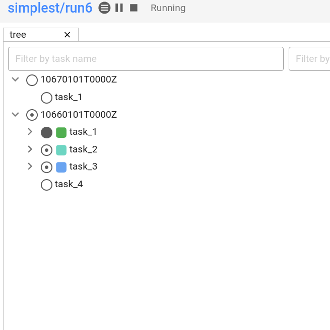
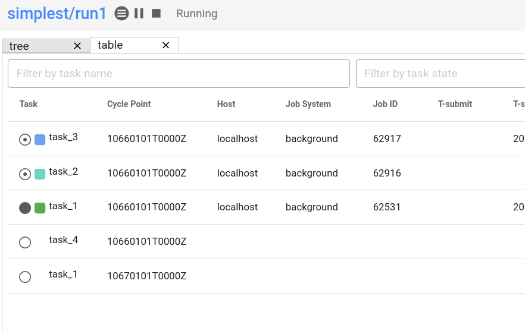

.. |task-waiting| image:: ../../img/task-job-icons/task-waiting.png
   :scale: 100%
   :align: middle

.. |task-submitted| image:: ../../img/task-job-icons/task-submitted.png
   :scale: 100%
   :align: middle

.. |task-running| image:: ../../img/task-job-icons/task-running.png
   :scale: 100%
   :align: middle

.. |task-succeeded| image:: ../../img/task-job-icons/task-succeeded.png
   :scale: 100%
   :align: middle

.. |job-submitted| image:: ../../img/task-job-icons/job-submitted.png
   :scale: 100%
   :align: middle

.. |job-running| image:: ../../img/task-job-icons/job-running.png
   :scale: 100%
   :align: middle

.. |job-succeeded| image:: ../../img/task-job-icons/job-succeeded.png
   :scale: 100%
   :align: middle

.. _tutorial-cylc-runtime-introduction:

Introduction
============

.. warning::

   This section of the tutorial still has screenshots of the obsolete Cylc 7
   desktop GUI, and it still uses a command from the ``Rose`` project to
   copy workflow source files.

.. ifnotslides::

   So far we have been working with the ``[scheduling]`` section. This is where
   the workflow is defined in terms of :term:`tasks <task>` and
   :term:`dependencies <dependency>`.

   In order to make the workflow do real work we must associate tasks with
   scripts or binaries to be executed when the task runs. The ``[runtime]``
   section which sets:

   - What scripts or binaries run.
   - What compute platform is used by task-jobs.

.. ifslides::

   ``[scheduling]``
      Defines the workflow in terms of :term:`tasks <task>` and
      :term:`dependencies <dependency>`.
   ``[runtime]``
      Defines what runs, where and how it runs.

The Task Section
----------------

.. ifnotslides::

   The runtime settings for each task are stored in a sub-section of the
   ``[runtime]`` section. E.g. for a task called ``hello_world`` we would write
   settings inside the following section:

.. code-block:: cylc

   [runtime]
       [[hello_world]]

.. note::

   A runtime sub-section for each task is normally required, even if it is
   empty. However, in the previous tutorials we disabled this requirement
   with :cylc:conf:`flow.cylc[scheduler]allow implicit tasks`.
   See :ref:`ImplicitTasks` for more details.

The ``script`` Setting
----------------------

.. ifnotslides::

   We tell Cylc *what* to execute when a task is run using the ``script``
   setting.

   This setting is interpreted as a bash script. The following example defines a
   task called ``hello_world`` which writes ``Hello World!`` to stdout upon
   execution.

.. code-block:: cylc

   [runtime]
       [[hello_world]]
           script = echo 'Hello World!'

.. note::

   If you do not set the ``script`` for a task then nothing will be run.

We can also call other scripts or executables in this way, e.g:

.. code-block:: cylc

   [runtime]
       [[hello_world]]
           script = ~/foo/bar/baz/hello_world

``PATH`` and :envvar:`PYTHONPATH`
---------------------------------

.. ifnotslides::

   It is often a good idea to keep our scripts with the Cylc workflow rather than
   leaving them somewhere else on the system. In the previous example
   ``script = ~/foo/bar/baz/hello_world``, ``~/`` would be different for
   each user, so this workflow cannot be reliably run by anyone other than the
   original author.

   If you create a ``bin/`` sub-directory within the :term:`source directory`,
   Cylc will automatically prepend it to the ``PATH`` environment variable when
   the task runs, allowing your task to run scripts in this folder.

.. code-block:: bash
   :caption: bin/hello_world

   #!/bin/bash
   echo 'Hello World!'

.. code-block:: cylc
   :caption: flow.cylc

   [runtime]
       [[hello_world]]
           script = hello_world

.. nextslide::

.. ifnotslides::

   Similarly the ``lib/python/`` directory gets prepended to the
   :envvar:`PYTHONPATH` variable.

.. code-block:: python
   :caption: lib/python/hello.py

   def world():
      print('Hello World!')

.. code-block:: cylc
   :caption: flow.cylc

   [runtime]
      [[hello_world]]
         script = python -c 'import hello; hello.world()'

.. _tutorial-tasks-and-jobs:

Tasks And Jobs
--------------

.. ifnotslides::

   When a :term:`task` is "Run" it creates a :term:`job`. The job is a bash
   file containing the script you have told the task to run along with
   configuration specifications and a system for trapping errors. It is the
   :term:`job` which actually gets executed and not the task itself. This
   "job file" is called the :term:`job script`.

   During its life a typical :term:`task` goes through the following states:

   Waiting
      :term:`Tasks <task>` wait for their dependencies to be satisfied before
      running. In the meantime they are in the "Waiting" state.
   Submitted
      When a :term:`task's <task>` dependencies have been met it is ready for
      submission. During this phase the :term:`job script` is created.
      The :term:`job` is then submitted to the specified :term:`job runner`.
      There is more about this in the :ref:`next section
      <tutorial-job-runner>`.
   Running
      A :term:`task` is in the "Running" state as soon as the :term:`job`
      execution starts.
   Succeeded
      If the :term:`job` submitted by a :term:`task` has successfully
      completed (i.e. there is zero return code) then it is said to have
      succeeded.

   These descriptions, and a few more (e.g. failed), are called the
   :ref:`task states <task-job-states>`.

.. ifslides::

   When a :term:`task` is "Run" it creates a :term:`job`.

   The life-cycle of a job:

   * Waiting
   * Submitted
   * Running
   * Succeeded / Failed

The Cylc GUI
------------

.. ifnotslides::

   To help you to keep track of a running workflow Cylc has a graphical user
   interface (the Cylc GUI) which can be used for monitoring and
   interaction.

   The Cylc GUI uses icons to indicate task states, and colour coded blocks
   to indicate the state of jobs run for those tasks. For example:

   .. table::

      =======================================================     ===========
      Task & Job States                                           Description
      =======================================================     ===========
      |task-waiting|       |job-blank|          waiting           waiting on prerequisites
      |task-submitted|     |job-submitted|      submitted         job submitted
      |task-running|       |job-running|        running           job running
      |task-succeeded|     |job-succeeded|      succeeded         job succeeded
      =======================================================     ===========

.. nextslide::

   Screenshot of the Cylc GUI "Tree View" tab.

.. nextslide::

   Screenshot of the Cylc GUI "Table View" tab.

.. TODO - Add new views when these become available.

.. note::

   A colour scheme designed to help users with colour blindness is available.
   In the GUI navigate to dashboard (top left) then settings.

Where Do All The Files Go?
--------------------------

.. ifnotslides::

   The Work Directory
   ^^^^^^^^^^^^^^^^^^

   When a :term:`task` is run Cylc creates a directory for the :term:`job` to
   run in. This is called the :term:`work directory`.

   By default the work directory is located in a directory structure
   under the relevant :term:`cycle point` and :term:`task` name:

   .. code-block:: sub

      ~/cylc-run/<workflow-name>/work/<cycle-point>/<task-name>

   The Job Log Directory
   ^^^^^^^^^^^^^^^^^^^^^

   When a task is run Cylc generates a :term:`job script` which is stored in the
   :term:`job log directory` as the file ``job``.

   When the :term:`job script` is executed the stdout and stderr are redirected
   into the ``job.out`` and ``job.err`` files which are also stored in the
   :term:`job log directory`.

   The :term:`job log directory` lives in a directory structure under the
   :term:`cycle point`, :term:`task` name and :term:`job submission number`:

   .. code-block:: sub

      ~/cylc-run/<workflow-name>/log/job/<cycle-point>/<task-name>/<job-submission-num>/

   The :term:`job submission number` starts at 1 and increments by 1 each time
   a task is re-run.

.. ifslides::

   The Work Directory
      .. code-block:: sub

         ~/cylc-run/<workflow-name>/work/<cycle-point>/<task-name>
   The Job Log Directory
      .. code-block:: sub

         ~/cylc-run/<workflow-name>/log/job/<cycle-point>/<task-name>/<job-submission-num>/

      .. image:: ../img/cylc-gui-view-log.png
         :align: center
         :scale: 75%

Running A Workflow
------------------

.. note::

   In this tutorial we are going to develop our workflow in ``~/cylc-scr``,
   use the ``cylc install`` command to install the workflow in ``~/cylc-run``.
   This pattern keeps the development and running of workflows separate.

.. ifnotslides::

   It is a good idea to check a workflow for errors before running it.
   Cylc provides a command which automatically checks for
   configuration issues called ``cylc validate``, run using:

.. code-block:: sub

   # workflow in ~/cylc-src/<name>
   cylc validate <name>

.. ifnotslides::

   Next we can install the workflow using ``cylc install``
   and finally run the workflow using the ``cylc play`` command.

.. code-block:: sub

   cylc install <name>
   cylc play <name>

.. ifnotslides::

   The ``name`` is the name of the :term:`run directory` (i.e. ``<name>``
   would be ``foo`` in the above example).

Generated Workflow Files
------------------------

.. ifnotslides::

   Cylc generates files and directories when it runs a workflow, namely:

   ``log/``
      Directory containing log files, including:

      ``log/db``
         The database which Cylc uses to record the state of the workflow;
      ``log/job``
         The directory where the :term:`job log files <job log>` live;
      ``log/workflow``
         The directory where the :term:`workflow log files <workflow log>` live.
         These files are written by Cylc as the workflow is run and are useful for
         debugging purposes in the event of error.
      ``flow-config/flow.cylc.processed``
         A copy of the :cylc:conf:`flow.cylc` file made after any `Jinja2`_ has been
         processed - we will cover this in the
         :ref:`tutorial-cylc-consolidating-configuration` section.

   ``share/``
      The :term:`share directory` is a place where :term:`tasks <task>` can
      write files which are intended to be shared within that cycle.
   ``work/``
      A directory hierarchy containing task's :term:`work directories
      <work directory>`.

.. ifslides::

   * ``log/``
      * ``log/db``
      * ``log/job``
      * ``log/workflow``
      * ``log/flow-config/flow.cylc.processed``
   * ``share/``
   * ``work/``

   .. nextslide::

   .. rubric:: In this practical we will add some scripts to, and run, the
      :ref:`weather forecasting workflow <tutorial-datetime-cycling-practical>`
      from the :ref:`scheduling tutorial <tutorial-scheduling>`.

   Next section: :ref:`tutorial-cylc-runtime-configuration`

.. practical::

   .. rubric:: In this practical we will add some scripts to, and run, the
      :ref:`weather forecasting workflow <tutorial-datetime-cycling-practical>`
      from the :ref:`scheduling tutorial <tutorial-scheduling>`.

   #. **Create A New Workflow.**

      The following command will copy some files for us to work with into
      a new workflow called ``runtime-introduction``:

      .. code-block:: bash

         cylc resource runtime-introduction
         cd ~/cylc-src/runtime-introduction

      In this directory we have the :cylc:conf:`flow.cylc` file from the
      :ref:`weather forecasting workflow <tutorial-datetime-cycling-practical>`
      with some runtime configuration added to it.

      There is also a script called ``get-observations`` located in the bin
      directory.

      Take a look at the ``[runtime]`` section in the :cylc:conf:`flow.cylc` file.

   #. **Run The Workflow.**

      First validate the workflow by running:

      .. code-block:: bash

         cylc validate .

      Open the Cylc GUI (in the background) by running the following command:

      .. code-block:: bash

         cylc gui runtime-introduction &

      Finally install and run the workflow by executing:

      .. code-block:: bash

         cylc install runtime-introduction
         cylc play runtime-introduction

      The tasks will start to run - you should see them going through the
      "Waiting", "Running" and "Succeeded" states.

      When the workflow reaches the final cycle point and all tasks have succeeded
      it will shutdown automatically and the GUI will go blank.

   #. **Inspect A Job Log.**

      Try opening the file ``job.out`` for one of the
      ``get_observations`` jobs in a text editor. The file will be
      located within the :term:`job log directory`:

      .. code-block:: sub

         ~/cylc-run/runtime-introduction/log/job/<cycle-point>/get_observations_heathrow/01/job.out

      You should see something like this:

      .. code-block:: none

         Workflow    : runtime-introduction
         Task Job : 20000101T0000Z/get_observations_heathrow/01 (try 1)
         User@Host: username@hostname

         Guessing Weather Conditions
         Writing Out Wind Data
         1970-01-01T00:00:00Z NORMAL - started
         2038-01-19T03:14:08Z NORMAL - succeeded

      * The first three lines are information which Cylc has written to the file
        to provide information about the job.
      * The lines in the middle are the stdout of the job itself.
      * The last two lines were also written by cylc. They provide timestamps
        marking the stages in the job's life.

   #. **Inspect A Work Directory.**

      The ``get_rainfall`` task should create a file called ``rainfall`` in its
      :term:`work directory`. Try opening this file, recalling that the
      format of the relevant path from within the work directory will be:

      .. code-block:: sub

         work/<cycle-point>/get_rainfall/rainfall

      .. hint::

         The ``get_rainfall`` task only runs every third cycle.

   #. **Extension: Explore The Cylc GUI**

      * Try re-running the workflow.

      * Try adding new view tabs:

        .. tip::

           You can do this from the "Add View" button at the top right:

           .. image:: ../img/cylc-gui-view-selector.png
              :align: center
              :scale: 75%

      * Try pressing the "Pause" button which is found near the play button.

      * Try exanding information on a task or job by pressing on >.
