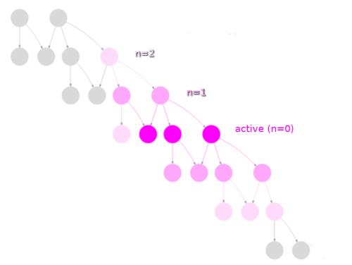
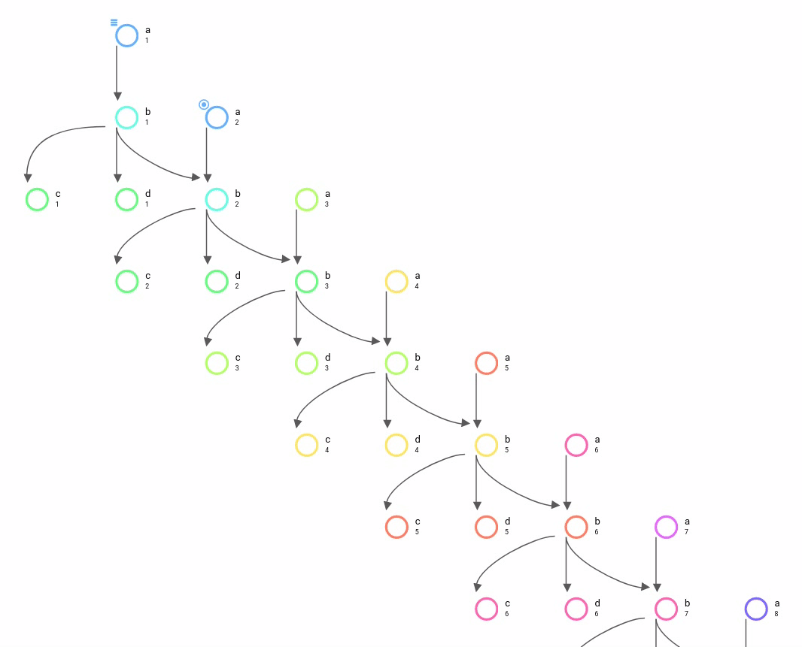

.. _task-job-states:

Tasks in the GUI/Tui
====================

Task & Job States
-----------------

**Tasks** are a workflow abstraction; they represent future and past jobs as
well as current active jobs. In the Cylc UI, task states have monochromatic
icons like this: |task-running|.

**Jobs** represent real job scripts submitted to run
on a :term:`job platform`. In the Cylc UI, job states have coloured icons like
this: |job-running|.

A single task can have multiple jobs, by automatic retry or manual triggering.

.. table::

   ============== ==================== =================== ====================================
   State          Task Icon            Job Icon            Description
   ============== ==================== =================== ====================================
   waiting        |task-waiting|                           waiting on prerequisites
   preparing      |task-preparing|                         job being prepared for submission
   submitted      |task-submitted|     |job-submitted|     job submitted
   running        |task-running|       |job-running|       job running
   succeeded      |task-succeeded|     |job-succeeded|     job succeeded
   failed         |task-failed|        |job-failed|        job failed
   submit-failed  |task-submit-failed| |job-submit-failed| job submission failed
   expired        |task-expired|                           will not submit job (too far behind)
   ============== ==================== =================== ====================================

The running task icon contains a clock face which shows the time elapsed
as a proportion of the average runtime.

.. image:: ../../img/task-job-icons/task-running-0.png
   :width: 50px
   :height: 50px
   :align: left

.. image:: ../../img/task-job-icons/task-running-25.png
   :width: 50px
   :height: 50px
   :align: left

.. image:: ../../img/task-job-icons/task-running-50.png
   :width: 50px
   :height: 50px
   :align: left

.. image:: ../../img/task-job-icons/task-running-75.png
   :width: 50px
   :height: 50px
   :align: left

.. image:: ../../img/task-job-icons/task-running-100.png
   :width: 50px
   :height: 50px
   :align: left

.. NOTE: these pipe characters are functional! They create a line break.

|

|

Task Modifiers
--------------

Tasks are run as soon as their dependencies are satisfied, however, there are
some other conditions which can prevent tasks from being run. These are
given "modifier" icons which appear to the top-left of the task icon:

.. list-table::
   :class: grid-table
   :align: left
   :widths: 20, 80

   * - .. image:: ../../img/task-job-icons/task-isHeld.png
          :width: 60px
          :height: 60px
     - **Held:** Task has been manually :term:`held <held task>` back from
       running.
   * - .. image:: ../../img/task-job-icons/task-isRunahead.png
          :width: 60px
          :height: 60px
     - **Runahead:** Task is held back by the :term:`runahead limit`.
   * - .. image:: ../../img/task-job-icons/task-isQueued.png
          :width: 60px
          :height: 60px
     - **Queued:** Task has been held back by an :term:`internal queue`.

.. _n-window:

The "n" Window
--------------

.. versionchanged:: 8.0.0

Cylc workflow :term:`graphs <graph>` can be very large, or infinite in
extent for :term:`cycling workflows <cycling workflow>` with no
:term:`final cycle point`.

Consequently the GUI often can't display "all of the tasks" at once. Instead
it displays all tasks in the :term:`active window` of the workflow, as well
as any tasks out to a configurable number of graph edges away from them in
the task dependency :term:`graph`.

n=0:
   The ``n=0`` window corresponds to the scheduler's :term:`active window`:
   tasks that are near ready to run, in the process of running, or
   which require user intervention. See the :term:`glossary <active window>`
   for a more detailed description.
n=1:
   The ``n=1`` window contains the ``n=0`` window plus all tasks out to one
   graph edge around them, i.e. their parents (the tasks that come immediately
   before them in the graph) and their descendants (immediately after them in the
   graph).
n=2:
   The ``n=2`` window extends out to *two* graph edges around
   the :term:`active window`, and so on.

This animation shows how the n-window advances as a workflow runs, tasks are
colour coded according to their n-window value with the colours changing from
``n=0`` (blue) to ``n=8`` (pink):

|

By default the GUI/Tui displays the ``n=1`` window. You can change this using
the "Set Graph Window Extent" command which is currently only available in the
GUI.

.. note::

   The "graph window extent" is a property of the workflow not a property of
   the GUI so persists between sessions. Better visibility and easier control
   over the n-window are planned in future releases of Cylc.

.. warning::

   High "graph window extent" values can cause a Cylc scheduler and the GUI
   to run slowly.
