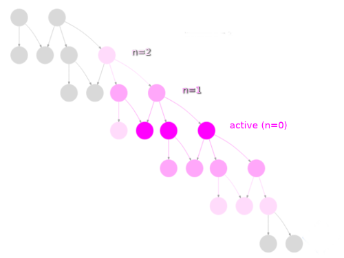
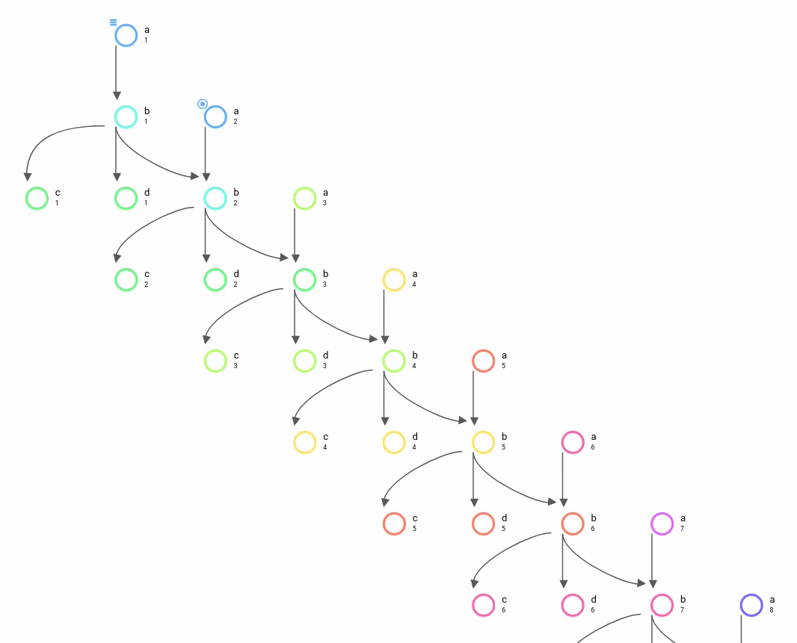
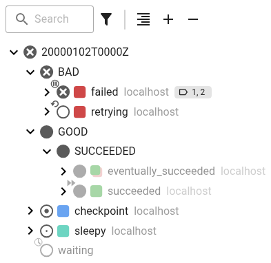

.. _task-job-states:

Tasks in the GUI/Tui
====================

Task & Job States
-----------------

**Tasks** are a workflow abstraction; they represent future and past jobs as
well as current active jobs. In the Cylc UI, task states have monochromatic
icons like this: |task-running|.

**Jobs** represent real job scripts submitted to run
on a :term:`job platform`. In the Cylc UI, job states have coloured icons like
this: |job-running|.

A single task can have multiple jobs, by automatic retry or manual triggering.

.. table::

   ============== ==================== =================== ====================================
   State          Task Icon            Job Icon            Description
   ============== ==================== =================== ====================================
   waiting        |task-waiting|                           waiting on prerequisites
   preparing      |task-preparing|                         job being prepared for submission
   submitted      |task-submitted|     |job-submitted|     job submitted
   running        |task-running|       |job-running|       job running
   succeeded      |task-succeeded|     |job-succeeded|     job succeeded
   failed         |task-failed|        |job-failed|        job failed
   submit-failed  |task-submit-failed| |job-submit-failed| job submission failed
   expired        |task-expired|                           will not submit job (too far behind)
   ============== ==================== =================== ====================================

The running task icon contains a clock face which shows the time elapsed
as a proportion of the average runtime.

.. NOTE: these pipe characters are functional! They create a line break.

|

|

.. _user_guide.task_modifiers:

Task Modifiers
--------------

Tasks are run as soon as their dependencies are satisfied, however, there are
some other conditions which can prevent tasks from being run. These are
given "modifier" icons which appear to the top-left of the task icon:

.. list-table::
   :class: grid-table
   :align: left
   :widths: 20, 80

   * - |task-held-large|
     - **Held:** Task has been manually :term:`held <held task>` back from
       running.
   * - |task-runahead-large|
     - **Runahead:** Task is held back by the :term:`runahead limit`.
   * - |task-skip-large|
     - **Skip Mode:** Task has/will be run in :term:`skip mode`.
   * - |task-queued-large|
     - **Queued:** Task has been held back by an :term:`internal queue`.
   * - |task-retry-large|
     - **Retry:** Task is waiting to :term:`retry`.
   * - |task-wallclock-large|
     - **Wallclock:** Task is waiting for a :term:`clock trigger`.
   * - |task-xtriggered-large|
     - **Xtriggered:** Task is waiting for an :term:`xtrigger`.

.. _n-window:

The "n" Window
--------------

.. versionchanged:: 8.0.0

Cylc workflow :term:`graphs <graph>` can be very large, or infinite in
extent for :term:`cycling workflows <cycling workflow>` with no
:term:`final cycle point`.

Consequently the GUI often can't display "all of the tasks" at once. Instead
it displays all tasks in a configurable :term:`n-window` around the current
:term:`active tasks <active task>`.

n=0:
   The ``n=0`` window contains current :term:`active tasks <active task>`: those
   that are near ready to run, running, or which may require user intervention.
n=1:
   The ``n=1`` window contains the ``n=0`` tasks plus those out
   to *one* graph edge around them in the graph.
n=2:
   The ``n=2`` window extends out to *two* graph edges from ``n=0``.

This animation shows how the n-window advances as a workflow runs, tasks are
colour coded according to their n-window value with the colours changing from
``n=0`` (blue) to ``n=8`` (pink):

|

By default the GUI/Tui displays the ``n=1`` window. You can change this using
the "Set Graph Window Extent" command which is currently only available in the
GUI.

.. note::

   The "graph window extent" is a property of the workflow not a property of
   the GUI so persists between sessions. Better visibility and easier control
   over the n-window are planned in future releases of Cylc.

.. warning::

   High "graph window extent" values can cause a Cylc scheduler and the GUI
   to run slowly.

.. _n-window.dimming:

Dimmed Tasks
^^^^^^^^^^^^

.. versionchanged:: cylc-ui 2.15.0

   Previously only tasks in the ``none`` :term:`flow` were dimmed. Now *all*
   tasks outside of the ``n=0`` window are dimmed.

In the GUI's **tree**, **table** and **graph** views, tasks (and families)
which are *not* in the ``n=0`` window, i.e. those with an ``n`` value greater
than zero, are displayed dimmed (greyed out):

* Tasks shown at **full opacity** are :term:`active tasks <active task>`
  (``n=0``). These are the tasks the scheduler is currently managing, e.g.
  running jobs, or tasks waiting on a prerequisite, :term:`xtrigger`,
  :term:`internal queue`, the :term:`runahead limit`, or on being
  :term:`resumed <held task>`.
* Tasks shown **dimmed** are :term:`inactive tasks <active task>` (``n>0``).
  These are past or future tasks, pulled into the view to provide context.
  The scheduler is not currently managing them, although you can still act on
  them, e.g. by triggering them.

|

In this example (the tree view), ``eventually_succeeded``, ``succeeded`` and
``waiting`` lie outside of the active window so are dimmed. The tasks left at
full opacity — ``failed``, ``retrying``, ``checkpoint`` and ``sleepy`` — are
the ``n=0`` tasks that Cylc is actively managing.

This makes it easy to see, at a glance, which part of the workflow Cylc is
actually working on.

.. note::

   Dimming is based on a task's position in the :term:`n-window`, not on its
   :term:`flow numbers <flow number>`. Tasks triggered in the ``none`` flow
   are typically outside of the ``n=0`` window, so they will usually appear
   dimmed too. To check a task's flows, click on it and look at the
   "Flows" field in the info view.

