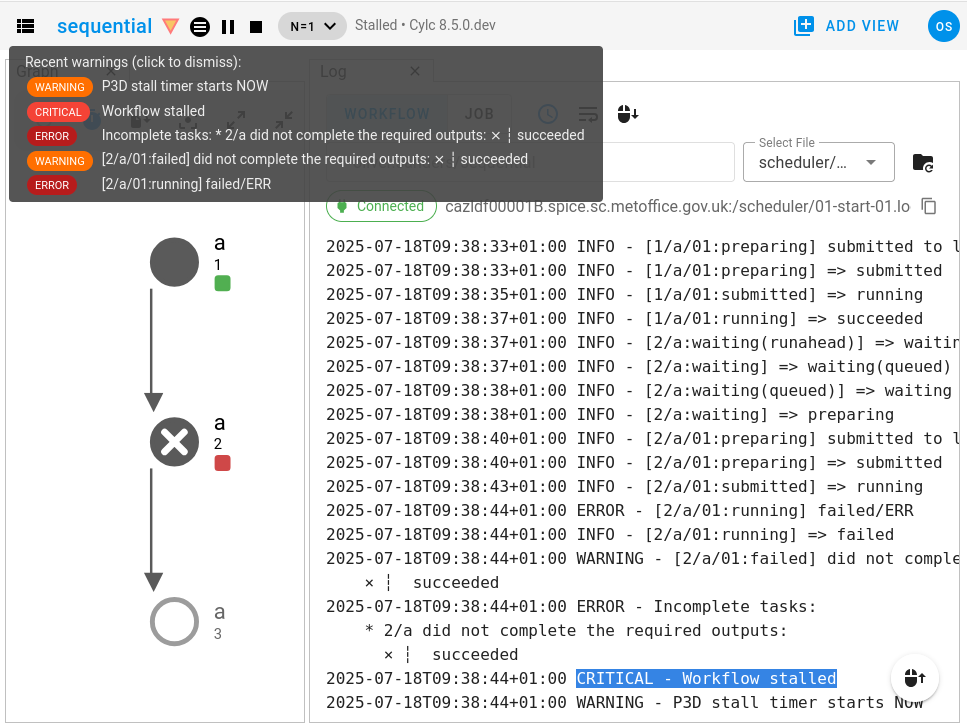

.. _workflow stop:

Workflow Stop
=============

If a scheduler shuts down, the workflow is *stopped* (see :ref:`workflow run states`).
Reasons for the scheduler to shut down include:

* It ran the workflow to :ref:`completion <workflow completion>`,

  - by reaching the :term:`final cycle point`
  - or by following a :term:`terminal branch` when there are no other active branches
* It received a ``stop`` command. (See ``cylc stop --help``)
* It reached a :term:`stop cycle point` prior to the :term:`final cycle point`.
* It :ref:`stalled <scheduler stall>` and the shutdown timer expired.
* The scheduler program was killed.

Restarting a stopped workflow resumes its pre-shutdown state.

.. _workflow completion:

Workflow Completion
===================

A scheduler shuts down automatically if it there are no more tasks to run. This can
happen after the :term:`final cycle point` which, if defined, marks the end of the
graph. In the following example, the final cycle point is ``2`` so
the workflow will stop after tasks ``2/b`` and ``2/c`` succeed:

.. code-block:: cylc

   [scheduling]
       cycling mode = integer
       initial cycle point = 1
       final cycle point = 2
       [[graph]]
           P1 = "a[-P1] => a => b & c"

.. digraph:: example
   :align: center

   "a\n1" -> "b\n1"
   "a\n1" -> "c\n1"
   "a\n1" -> "a\n2"
   "a\n2" -> "b\n2"
   "a\n2" -> "c\n2"

A workflow can also stop automatically as complete without running the whole of
the graph, if the flow follows a :term:`terminal branch` at runtime and there
are no other active branches. In the following example, if task ``a`` succeeds
the flow will continue on to the next cycle, but on failure it will shut down
as complete after running the ``end`` task - which does not lead on to the rest
of the graph.

.. code-block:: cylc-graph

   a[-P1]? => a => b & c
   a:failed? => end

.. digraph:: example
   :align: center

   subgraph cluster_success {
      label = ":succeeded"
      color = "green"
      fontcolor = "green"
      style = "dashed"

      "a\n2"
   }

   subgraph cluster_failure {
      label = ":failed"
      color = "red"
      fontcolor = "red"
      style = "dashed"

      "end\n1"
   }

   subgraph cluster_success_2 {
      label = ":succeeded"
      color = "green"
      fontcolor = "green"
      style = "dashed"

      "a\n3"
   }

   subgraph cluster_failure_2 {
      label = ":failed"
      color = "red"
      fontcolor = "red"
      style = "dashed"

      "end\n2"
   }

   "a\n1" -> "b\n1"
   "a\n1" -> "c\n1"
   "a\n1" -> "end\n1"
   "a\n1" -> "a\n2"

   "a\n2" -> "b\n2"
   "a\n2" -> "c\n2"
   "a\n2" -> "end\n2"
   "a\n2" -> "a\n3"

   "a\n3" -> "b\n3"
   "a\n3" -> "c\n3"
   "a\n3" -> "end\n3"

.. warning::

   An :term:`optional <optional output>` task ``:succeeded`` output (which implies
   optional ``:failed`` too) makes an implicit zero-length (invisible!)
   :term:`terminal branch` if nothing triggers from the task failure - e.g. if we
   remove ``a:failed? => end`` from the example above. Be careful not to do this
   by mistake. Optional success should normally be used with an explicit failure branch.

Continuing After Shutdown
-------------------------

Restarting a stopped workflow resumes its pre-shutdown state.

If the workflow did not run to completion already, it can simply continue on
from where it stopped.

If it did run to completion, it will resume as completed but the scheduler will
stay up on a :cylc:conf:`restart timeout <[scheduler][events]restart timeout>`
to allow you to
:ref:`re-trigger past tasks <interventions.re-run-multiple-tasks>`
or :ref:`trigger a new flow <interventions.reflow>` in the graph.

.. _extend-stop-point:

Extending Beyond a Stop Cycle Point
^^^^^^^^^^^^^^^^^^^^^^^^^^^^^^^^^^^

It is easy to run more cycles after shutting down at a :term:`stop cycle point`
because that is not the end of the graph. Simply restart with a later stop point.
The workflow will continue on automatically from the original stop point.

For a worked example, see :ref:`examples.extending-workflow`.

.. _extend-fcp:

Extending Beyond a Final Cycle Point
^^^^^^^^^^^^^^^^^^^^^^^^^^^^^^^^^^^^

Running more cycles after :ref:`workflow completion` at a :term:`final cycle point`
can be difficult because it means extending the graph itself by adding *new
dependence* on *past events*. You will need to manually trigger the extended graph
after restart, because Cylc does not automatically revisit past events to see if the
graph changed around them.

.. note::

   If you don't need to use a :term:`final cycle point` it is much easier to extend
   a run past a :term:`stop cycle point`, which is not the end of the graph.
   See :ref:`extend-stop-point`.

Triggering the extended graph requires a good understanding of your workflow structure.
Identify the subgraph containing initial tasks that lead into the extended graph and
later tasks (if any) that also depend on the old graph, and manually trigger all of
them as a group with a single ``cylc trigger`` command (this satisfies any off-group
prerequisites to prevent a stall). As a short cut, you may be able to trigger the
first extended cycle with ``cylc trigger <workflow>//<cycle>/*``

.. _scheduler stall:

Scheduler Stall
===============

If a workflow has not run to :ref:`completion <workflow completion>` but Cylc cannot
continue without manual intervention, the workflow is :term:`stalled <stall>`.
A workflow has stalled if:

* It has not run to completion (i.e, there are still tasks left to run).
* AND no tasks are waiting on unsatisfied
  :ref:`external events <Section External Triggers>` (e.g, clock triggers
  and xtriggers).
* AND all activity has ceased (i.e, no preparing, submitted or running tasks).

Stalls are caused by :term:`incomplete tasks <incomplete task>`
and :term:`partially satisfied tasks <prerequisite>`. The exact reason will
be logged by the scheduler - see :ref:`diagnosing stalls` below.
These usually result from task failures that the workflow does not
handle automatically by :term:`retries <retry>` or :term:`graph branching`.

Continuing typically involves
:ref:`fixing and rerunning a failed task <interventions.edit-a-tasks-configuration>`.

.. _diagnosing stalls:

Diagnosing Stalls
-----------------

A screenshot of the Cylc GUI displaying a stalled workflow:

|

In the above screenshot:

* The stall was caused by the failure of the task ``2/a``.
* The stall event is recorded in the :term:`workflow log` file (shown on the
  right) along with the list of :term:`incomplete tasks <output completion>`
  that caused it (2/a did not complete the required outputs: succeeded).
* In the GUI, the :ref:`warning triangle <changes.warning_triangles>`
  will light up to notify you of the error, hover over it to see the log
  messages.

Stall Timeouts
--------------

A stalled scheduler stays alive for a configurable timeout period
to allow you to intervene, e.g. by manually triggering an incomplete
task after fixing the bug that caused it to fail.

If a stalled workflow does eventually shut down, on the stall timeout
or by stop command, it will immediately stall again on restart to await
manual intervention.

Stall timeout behaviour is controlled by the following configurations:

.. admonition:: Configuration
   :class: note

   :cylc:conf:`[scheduler][events]stall timeout`
      The length of time before a stalled workflow will shut down.
   :cylc:conf:`[scheduler][events]abort on stall timeout`
      Whether the scheduler should shut down immediately with error status if
      the stall timeout is reached.

Stall Events
------------

Cylc emits the :ref:`stall <user_guide.workflow_events.stall>` event when a
scheduler stalls.

.. admonition:: Configuration
   :class: note

   :cylc:conf:`[scheduler][events]mail events = stall`
      Configure emails for stall events.
   :cylc:conf:`[scheduler][events]stall handlers`
      Configure custom event handlers to run on stall events.
