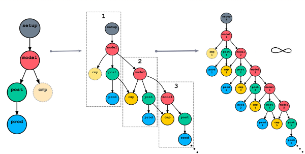

.. _Cycling Workflows:

Cycling Workflows
=================

A *cycling workflow* is a repetitive process involving many interdependent
tasks. Cylc tasks are distinct *applications*, i.e. executable commands,
scripts, or programs. Example use cases include:

- Processing many similar datasets 

- Climate, weather, and weather-driven forecasting systems that generate new
  forecasts at regular intervals

- Splitting a single long scientific model run into many smaller runs, each with
  associated pre- and post-processing tasks

- Iterative tuning of scientific model parameters, using model runs and
  processing and validation tasks 

Cycling systems were traditionally handled by repeat-running a single workflow,
one cycle after another. Sometimes, however, it would be more efficient to run
multiple cycles concurrently, or at least allow them to overlap. But this can't
be done if there is any implicit intercycle dependence, or if the workflow
engine has a global loop that must finish one cycle before starting the next.

.. important::

  Cylc handles inter- and intra-cycle dependence equally and unrolls the cycle
  loop to create a single non-cycling workflow of repeating tasks, each with
  its own *cycle point*.

Consequently Cylc can achieve maximum concurrency across as well as within
cycles, allowing fast catch-up from delays in real time systems, and
sustained high throughput off the clock.
