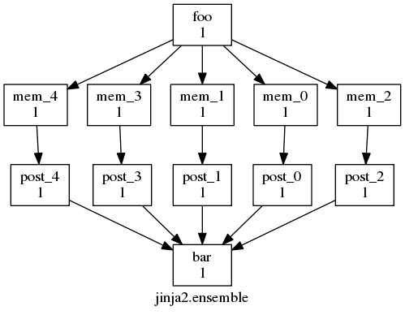
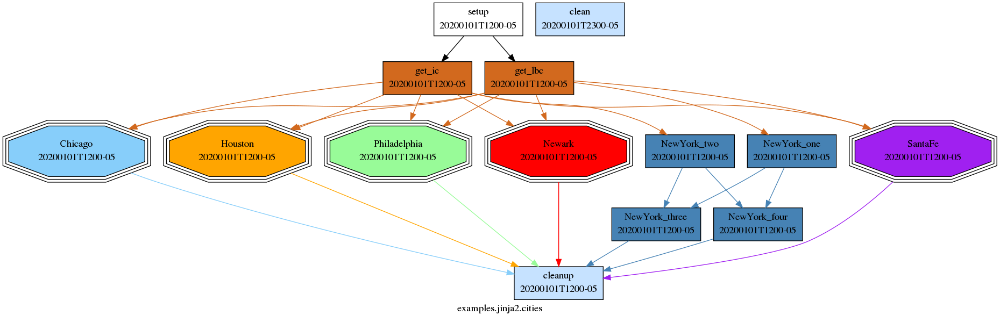

.. _Jinja:
.. _User Guide Jinja2:

Jinja2
======

.. tutorial::
   Configuration Consolidation Tutorial <tutorial-cylc-consolidating-configuration>

Cylc supports the `Jinja2`_ template processor in workflow configurations.
Jinja2 code can appear anywhere in the file. The result after Jinja2 processing
must be valid Cylc syntax.

To use Jinja2, put a hash-bang comment in the first line of :cylc:conf:`flow.cylc`:

.. code-block:: cylc

   #!jinja2

Embedded Jinja2 code should be reasonably easy to understand for those with
coding experience; otherwise Jinja2 is documented `here <Jinja2_>`_.

Uses of Jinja2 in Cylc include:

 - Inclusion or exclusion of config sections by logical switch, e.g. to make
   portable workflows
 - Computation of config values from input data
 - Inclusion of files and sub-templates
 - Looping over parameters to generate groups of similar tasks and associated
   dependencies - but see :ref:`Parameterized Tasks <User Guide Param>` for a
   simpler alternative to this where appropriate

.. _fig-jinja2-ensemble:

   The Jinja2 ensemble example workflow graph.

The graph above shows an ensemble of similar tasks generated with a Jinja2 loop:

.. code-block:: cylc

   #!jinja2
   
   [scheduling]
       [[graph]]
           R1 = """
   {# generate ensemble dependencies #}
   
               foo => mem_{{ I }} => post_{{ I }} => bar
   
           """

Note that Jinja2 code is encapsulated in curly braces to distinguish it from
the surrounding text.

    ================= ======================
    Jinja2 Syntax     Description
    ================= ======================
    ``{# comment #}`` Comment
    ```` Expression
    ``{{ var }}``     Print statement
    ================= ======================

Here is the workflow configuration after Jinja2 processing:

.. code-block:: cylc

   #!jinja2
   [scheduling]
       [[graph]]
           R1 = """
               foo => mem_0 => post_0 => bar
               foo => mem_1 => post_1 => bar
               foo => mem_2 => post_2 => bar
               foo => mem_3 => post_3 => bar
               foo => mem_4 => post_4 => bar
           """

This example illustrates Jinja2 loops nicely, but note it is now easier
to generate task names automatically with built-in
:ref:`task parameters <User Guide Param>`:

.. code-block:: cylc

   [task parameters]
       m = 0..4
   [scheduling]
       [[graph]]
           R1 = "foo => mem<m> => post<m> => bar"

The next workflow, which generates weather forecasts over a number of cities, is
more complex. To add a new city and associated tasks and dependencies just add
the new city name to list at the top of the file. It makes use of Jinja2
variables, loops, math, and logical flags to include or exclude tasks.

.. tip::
   This example could also be simplified with built in
   :ref:`task parameters <User Guide Param>`

.. literalinclude:: ../../workflows/jinja2/cities/flow.cylc
   :language: cylc

.. _fig-jinja2-cities:

   Jinja2 cities example workflow graph, with the
   New York City task family expanded.

.. _jinja2.workflow_files:

Access to Workflow Files
------------------------

Your Jinja2 code can see the workflow directory by using
:ref:`Python code <jinja2.importing_python_modules>`
that simply reads from the *current working directory*.

This will be the source directory if parsing a source workflow, or the run
directory if parsing an installed workflow.

.. _jinja2.workflow_context:

Workflow Context variables
--------------------------

Jinja2 CYLC variables available when parsing any workflow (source or installed):

.. table::

   ======================    ==============
   CYLC_VERSION              Version of Cylc parsing the configuration
   CYLC_WORKFLOW_NAME        Workflow name (source, or run ID minus run name)
   CYLC_WORKFLOW_SRC_DIR     Path of the source directory.
   CYLC_TEMPLATE_VARS        Variables set by '--set' CLI options or plugins
   ======================    ==============

Additional Jinja2 CYLC variables available when parsing an installed workflow:

.. table::

   ======================    ==============
   CYLC_WORKFLOW_ID          Workflow ID
   CYLC_WORKFLOW_RUN_DIR     Workflow run directory
   ======================    ==============

Additional Jinja2 CYLC variables available when the scheduler is parsing an
installed workflow at run time:

.. table::

   =======================    ==============
   CYLC_WORKFLOW_LOG_DIR      Workflow scheduler's log directory
   CYLC_WORKFLOW_SHARE_DIR    Workflow share sub-directory
   CYLC_WORKFLOW_WORK_DIR     Workflow work sub-directory
   =======================    ==============

.. note::

   Set default values for CYLC variables that are only defined for installed or
   running workflows, to allow successful parsing in other contexts as well.
   For example:

   .. code-block:: cylc

      {{ CYLC_WORKFLOW_RUN_DIR | default("not-defined") }}

.. _Jinja2Filters:

Jinja2 Filters, Tests and Globals
---------------------------------

.. _Jinja2 Built-in Globals: https://jinja.palletsprojects.com/en/stable/templates/#list-of-global-functions
.. _Jinja2 Built-in Filters: https://jinja.palletsprojects.com/en/stable/templates/#list-of-builtin-filters
.. _Jinja2 Built-in Tests: https://jinja.palletsprojects.com/en/stable/templates/#builtin-tests

Jinja2 provides "globals", "filters" and "tests" which can be helpful in
workflow writing.

Globals
   Regular Python functions.

   :Jinja2 builtins: `Jinja2 Built-in Globals`_
   :Cylc builtins: :ref:`user-guide.jinja2.cylc-builtin-globals`
   :Custom directory: :ref:`Jinja2Globals <user-guide.jinja2.custom-extensions>`
Filters
   Special functions which "chain" using the pipe character (``|``).

   :Jinja2 builtins: `Jinja2 Built-in Filters`_
   :Cylc builtins: :ref:`user-guide.jinja2.cylc-builtin-filters`
   :Custom directory: :ref:`Jinja2Filters <user-guide.jinja2.custom-extensions>`
Tests
   Special functions which work with the ``is`` operator.

   :Jinja2 builtins: `Jinja2 Built-in Tests`_
   :Custom directory: :ref:`Jinja2Tests <user-guide.jinja2.custom-extensions>`

For example, this :cylc:conf:`flow.cylc` file uses the
:py:func:`pad <cylc.flow.jinja.filters.pad.pad>` filter to help write out
task definitions:

.. code-block:: cylc

   [runtime]
   
       [[task_{{ x | pad(3) }}]]
           script = sleep {{ x }}
   

The Jinja2 would be expanded like so:

.. code-block:: cylc

   [runtime]
       [[x_001]]
           script = sleep 1
       [[x_002]]
           script = sleep 2
       [[x_003]]
           script = sleep 3

In addition to the built-ins that Jinja2 and Cylc provide, you can also define
your own custom filters (see :ref:`user-guide.jinja2.custom-extensions`).

.. _user-guide.jinja2.cylc-builtin-globals:

Cylc Built-in Globals
^^^^^^^^^^^^^^^^^^^^^

.. list-table::

   * - :py:data:`environ`
     - Access environment variables.
   * - :py:func:`raise`
     - Raise an error.
   * - :py:func:`assert`
     - Raise an error if a condition is not met.

.. _jinja2-environ:

.. py:data:: environ

   Provides access to environment variables.

   Note, these are the "parse-time" environment variables - i.e, the environment
   that is set when the workflow's :cylc:conf:`flow.cylc` file is processed.
   This happens when a workflow is validated or started, not when jobs are
   submitted. Jinja2 does not have access to dynamic environment variables
   available to jobs.

   .. describe:: Jinja2 Examples:

      .. code-block:: cylc

         [runtime]
             [[root]]
                 [[[environment]]]
                     HOME_DIR_ON_WORKFLOW_HOST = {{environ['HOME']}}

.. _jinja2-raise:

.. py:function:: raise(error_message)

   The ``raise`` function will result in an error containing the provided text.

   Calling this will cause ``cylc validate`` to fail with the provided error
   message and will prevent the workflow from being started. It's useful for
   validating input template variables.

   .. describe:: Jinja2 Examples:

      .. code-block:: cylc

         
             {{ raise('VARIABLE must be defined for this workflow.') }}
         

.. _jinja2-assert:

.. py:function:: assert(condition, error_message)

   The ``assert`` function will raise an exception containing the text provided
   in the second argument providing that the first argument evaluates as False.
   The following example is equivalent to the "raise" example above.

   Assertion errors will ``cylc validate`` to fail with the provided error
   message and will prevent the workflow from being started. It's useful for
   validating input template variables.

   .. describe:: Jinja2 Examples:

      .. code-block:: cylc

         {{ assert(VARIABLE is defined, 'VARIABLE must be defined for this workflow.') }}

.. _user-guide.jinja2.cylc-builtin-filters:

Cylc Built-in Filters
^^^^^^^^^^^^^^^^^^^^^

.. autosummary::
   :nosignatures:

   cylc.flow.jinja.filters.pad.pad
   cylc.flow.jinja.filters.strftime.strftime
   cylc.flow.jinja.filters.duration_as.duration_as

.. autofunction:: cylc.flow.jinja.filters.pad.pad

.. autofunction:: cylc.flow.jinja.filters.strftime.strftime

.. autofunction:: cylc.flow.jinja.filters.duration_as.duration_as

.. _CustomJinja2Filters:
.. _user-guide.jinja2.custom-extensions:

Custom Jinja2 Extensions
^^^^^^^^^^^^^^^^^^^^^^^^

Custom Jinja2 globals, filters and tests can be defined within workflows.

These extensions are Python modules containing a function with the same name
as the module (e.g, a module called ``foo.py`` should contain a function called
``foo``).

Jinja2 globals go in the workflow :term:`source directory` in a subdirectory
called ``Jinja2Globals``, filters in ``Jinja2Filters`` and tests in
``Jinja2Tests``.

This example defines one of each and demonstrates how to use them:

.. code-block:: cylc
   :caption: flow.cylc

   #!Jinja2

   # "globals" are regular Python functions
   {{ square(5) }}

   # filters are special functions which chain using the pipe character
   {{ ('run', 1) | display_name }}

   # tests are special functions which work with the "is" operator
   {{ 42 is even }}

.. code-block:: python
   :caption: Jinja2Filters/display_name.py

   def display_name(argument):
       name, number = argument
       return f'{name}_x{number:03d}'

.. code-block:: python
   :caption: Jinja2Globals/square.py

   def square(number):
       return number ** 2

.. code-block:: python
   :caption: Jinja2Tests/even.py

   def even(number):
       return number % 2 == 0

.. seealso::

   Jinja2 documentation:

   - `Custom Filters <https://jinja.palletsprojects.com/en/stable/api/#custom-filters>`_
   - `Custom Tests <https://jinja.palletsprojects.com/en/stable/api/#custom-tests>`_

.. _stdlib-imports-notice:

.. important::

   Only Python modules that are available in the environment used to run Cylc,
   or the ``lib/python`` directory, can be imported inside custom globals, filters and tests.
   You should avoid importing external modules that are not available in either
   the standard library, Jinja2, Cylc, or Isodatetime,
   as this could break between Cylc versions or when running on different systems.

Associative Arrays In Jinja2
----------------------------

Associative arrays (or **dictionaries**) are very useful. For example:

.. code-block:: cylc

   #!Jinja2
   
   

   [scheduling]
       [[graph]]
           R1 = OBS
   [runtime]
       [[OBS]]
           platform = platform_using_pbs
       
       [[ {{i}} ]]
           inherit = OBS
           [[[directives]]]
                -I = {{ resource[i] }}
        

Here's the result:

.. code-block:: console

   $ cylc config -i [runtime][airs]directives <workflow-id>
   -I = ncpus=9

.. _jinja2-template-variables:

Default Values and Template Variables
-------------------------------------

You can provide template variables to Cylc in 4 ways:

- Using the ``--set-file`` (``-S``) option.
- Using the ``--set`` (``-s``) option.
- Using the ``--set-list`` (``-z``) option.
- `Using a plugin`_, such as :ref:`Cylc Rose`.

.. note::

   If the same variable is set by more than one method, the last source in the
   above list is used.

The ``-s``, ``-z`` and ``--set-file`` Options
^^^^^^^^^^^^^^^^^^^^^^^^^^^^^^^^^^^^^^^^^^^^^

.. code-block:: console

   $ # set the Jinja2 variable "answer" to 42
   $ cylc play <workflow-id> -s answer=42

A Python string-list is a valid value, but a lot to type, so ``--set-list``
(``-z``) is provided as a convenience:

.. code-block:: console

   # The set syntax
   $ cylc play <workflow-id> -s "answers=['mice', 'dolphins']"
   # ... can  be shortened to:
   $ cylc play <workflow-id> -z answers=mice,dolphins

If you need to define a lot of variables, you can so in a file
using the ``--set-file`` option:

.. code-block:: console

   $ # create a set file
   $ cat > my-set-file <<__SET_FILE__
   question='the meaning of life, the universe and everything'
   answer=42
   host='deep-thought'
   __SET_FILE__

   $ # run using the options in the set file
   $ cylc play <workflow-id> --set-file my-set-file

Values must be Python literals e.g:

.. code-block:: python

   "string"   # string
   123        # integer
   12.34      # float
   True       # boolean
   None       # None type
   [1, 2, 3]  # list
   (1, 2, 3)  # tuple
   {1, 2, 3}  # set
   {"a": 1, "b": 2, "c": 3}  # dictionary

.. note::

   On the command line you may need to wrap strings with an extra
   pair of quotes as the shell you are using (e.g. Bash) will strip
   the outer pair of quotes.

   .. code-block:: console

      $ # wrap the key=value pair in single quotes stop the shell from
      $ # stripping the inner quotes around the string:
      $ cylc play <workflow-id> -s 'my_string="a b c"'

Here's an example:

.. literalinclude:: ../../workflows/jinja2/defaults/flow.cylc
   :language: cylc

Here's the result:

.. code-block:: console

   $ cylc list <workflow-id>
   Jinja2 Template Error
   'FIRST_TASK' is undefined
   cylc-list <workflow-id>  failed:  1

   $ # Note: quoting "bob" so that it is evaluated as a string
   $ cylc list --set 'FIRST_TASK="bob"' <workflow-id>
   bob
   baz
   mem_2
   mem_1
   mem_0

   $ cylc list --set 'FIRST_TASK="bob"' --set 'LAST_TASK="alice"' <workflow-id>
   bob
   alice
   mem_2
   mem_1
   mem_0

   $ # Note: no quotes required for N_MEMBERS since it is an integer
   $ cylc list --set 'FIRST_TASK="bob"' --set N_MEMBERS=10 <workflow-id>
   mem_9
   mem_8
   mem_7
   mem_6
   mem_5
   mem_4
   mem_3
   mem_2
   mem_1
   mem_0
   baz
   bob

Note also that ``cylc view --set FIRST_TASK=bob --jinja2 <workflow-id>``
will show the workflow with the Jinja2 variables as set.

.. note::

   Workflows started with template variables set on the command
   line will :term:`restart` with the same settings. You can set
   them again on the ``cylc play`` command line if they need to
   be overridden.

Using a plugin
^^^^^^^^^^^^^^

Template plugins such as :ref:`Cylc Rose` should provide a set of template
variables which can be provided to Cylc. For example, using Cylc Rose you
add a ``rose-suite.conf`` file containing a ``[template variables]``
section which the plugin makes available to Cylc:

.. code-block:: ini
   :caption: rose-suite.conf

   [template variables]
   ICP=1068

.. code-block:: cylc
   :caption: flow.cylc

   #!jinja2
   [scheduler]
      allow implicit tasks = True
   [scheduling]
      initial cycle point = {{ICP}}
      [[dependencies]]
         P1Y = Task1

.. code-block:: console

   $ cylc config . -i "[scheduling]initial cycle point"
   1068

Jinja2 Variable Scope
---------------------

Jinja2 variable scoping rules may be surprising. For instance, variables set
inside a ``for`` loop can't be accessed outside of the block,
so the following will not print ``# FOO is True``:

.. code-block:: cylc

   
   
       
           
       
   
   # FOO is {{FOO}}

Jinja2 documentation suggests using alternative constructs like the loop
``else`` block or the special ``loop`` variable. More complex use cases can be
handled using ``namespace`` objects that allow propagating of changes across scopes:

.. code-block:: cylc

   
   
       
           
       
   
   # FOO is {{ns.foo}}

For detail, see
`Jinja2 Template Designer Documentation - Assignments
<https://jinja.palletsprojects.com/en/3.0.x/templates/#assignments>`_

.. _jinja2.importing_python_modules:

Importing Python modules
------------------------

Jinja2 allows to gather variable and macro definitions in a separate template
that can be imported into (and thus shared among) other templates.
For example, if we have a file in the source directory called ``utils.cylc``,
we can use it in ``flow.cylc`` in a couple of ways:

.. code-block:: cylc

   
   
   {{ utils.VARIABLE is equalto(ALIAS)) }}

Cylc extends this functionality to allow import of arbitrary Python modules.

.. code-block:: cylc

   
   [runtime]
   
       [[{{group}}_{{member}}]]
   

For better clarity and disambiguation Python modules can be prefixed with
``__python__``:

.. code-block:: cylc

   

.. important::

   As :ref:`before <stdlib-imports-notice>`,
   you can only import modules that are available in the environment used to run Cylc,
   or the ``lib/python`` directory.

Macros
------

`Jinja2 macros <https://jinja.palletsprojects.com/en/stable/templates/#macros>`_
can be used to automatically construct parts of your workflow based on input parameters (macro arguments).

Here's an example macro that adds a task to print a given word (default "hello"), after a given task in your graph:

.. code-block:: cylc

   
   [scheduling]
       [[graph]]
           R1 = {{ after_task }} => say_{{ word }}
   [runtime]
       [[say_{{ word }}]]
           script = "echo {{ word }}"
   

If we have written this to a file in the source directory called ``macros.cylc``,
it can be used in ``flow.cylc`` like so:

.. code-block:: cylc

   #!Jinja2
   

   {{ say_it(after_task="b") }}
   {{ say_it(after_task="c", word="goodbye") }}
   [scheduling]
       [[graph]]
           R1 = a => b => c
   [runtime]
       [[a, b, c]]

Here's the result after template processing and config parsing:

.. code-block:: cylc

   [scheduling]
       [[graph]]
           R1 = """
               b => say_hello
               c => say_goodbye
               a => b => c
           """
   [runtime]
       [[say_hello]]
           script = echo hello
       [[say_goodbye]]
           script = echo goodbye
       [[a, b, c]]

Logging
-------

It is possible to output messages to the Cylc log from within Jinja2, these
messages will appear on the console when validating or starting a workflow.
This can be useful for development or debugging.

Example :cylc:conf:`flow.cylc`:

.. code-block:: cylc

   #!Jinja2
   
   

Example output:

.. code-block:: console

   $ cylc validate . --debug
   DEBUG - Loading site/user config files
   DEBUG - Reading file <file>
   DEBUG - Processing with Jinja2
   DEBUG - Hello World!
   ...
   Valid for cylc-<version>

Log messages will appear whenever the workflow configuration is loaded so it is
advisable to use the ``DEBUG`` logging level which is suppressed unless the
``--debug`` option is provided.

Debugging
---------

It is possible to run Python debuggers from within Jinja2 via the
:ref:`import mechanism <jinja2.importing_python_modules>`.

.. _PDB: https://docs.python.org/3/library/pdb.html

For example to use a `PDB`_ breakpoint you could do the following:

.. code-block:: cylc

   #!Jinja2

   

   
   

The debugger will open within the Jinja2 code, local variables can be accessed
via the ``_Context__self`` variable e.g:

.. code-block:: console

   $ cylc validate <id>
   (Pdb) _Context__self['ANSWER']
   42
